WHITEPAPER

**Nichtdelegierbare Bauherrenverantwortung und Minimum Viable Governance für komplexe Bau- und Infrastrukturprojekte**

Ein Whitepaper von Bauherr Mentoren zur Führungs-, Entscheidungs- und Nachweisfähigkeit von Bauherren im DACH-Raum

Inhalt

[1 Kurzfassung [4](#kurzfassung)](#kurzfassung)

[1.1 Leitthese [4](#leitthese)](#leitthese)

[1.2 Managementaussagen [5](#managementaussagen)](#managementaussagen)

[1.3 Ergebnisbild [5](#ergebnisbild)](#ergebnisbild)

[2 Ausgangslage und Kernproblem [6](#ausgangslage-und-kernproblem)](#ausgangslage-und-kernproblem)

[2.1 Volatile Märkte und Infrastrukturprogramme [7](#volatile-märkte-und-infrastrukturprogramme)](#volatile-märkte-und-infrastrukturprogramme)

[2.2 Steigende Komplexität durch ESG, LCC und Nachweislogik [7](#steigende-komplexität-durch-esg-lcc-und-nachweislogik)](#steigende-komplexität-durch-esg-lcc-und-nachweislogik)

[2.3 Wissensverlust und Schlüsselrollen [7](#wissensverlust-und-schlüsselrollen)](#wissensverlust-und-schlüsselrollen)

[2.4 Warum Berichterstattung das Kernproblem nicht löst [7](#warum-berichterstattung-das-kernproblem-nicht-löst)](#warum-berichterstattung-das-kernproblem-nicht-löst)

[2.5 Symptome fehlender Ausübungsfähigkeit [8](#symptome-fehlender-ausübungsfähigkeit)](#symptome-fehlender-ausübungsfähigkeit)

[3 Begriffsrahmen – delegierbare Arbeit, Mandat und nichtdelegierbare Verantwortung [10](#begriffsrahmen-delegierbare-arbeit-mandat-und-nichtdelegierbare-verantwortung)](#begriffsrahmen-delegierbare-arbeit-mandat-und-nichtdelegierbare-verantwortung)

[3.1 Arbeitsdefinition [10](#arbeitsdefinition)](#arbeitsdefinition)

[3.2 Delegierbar und nicht delegierbar [11](#delegierbar-und-nicht-delegierbar)](#delegierbar-und-nicht-delegierbar)

[3.3 Die Verantwortungspyramide – Arbeitsebene, Mandatsebene und Letztverantwortung [12](#die-verantwortungspyramide-arbeitsebene-mandatsebene-und-letztverantwortung)](#die-verantwortungspyramide-arbeitsebene-mandatsebene-und-letztverantwortung)

[4 Verantwortungsfelder des Bauherrn [13](#verantwortungsfelder-des-bauherrn)](#verantwortungsfelder-des-bauherrn)

[4.1 Ziel [15](#ziel)](#ziel)

[4.2 Mandat [15](#mandat)](#mandat)

[4.3 Wesentliche Entscheidung [15](#wesentliche-entscheidung)](#wesentliche-entscheidung)

[4.4 Risikoannahme [15](#risikoannahme)](#risikoannahme)

[4.5 Freigabe [16](#freigabe)](#freigabe)

[4.6 Datenstand und Nachweis [16](#datenstand-und-nachweis)](#datenstand-und-nachweis)

[5 Minimum Viable Governance als Bauherren-Führungsmodell [17](#minimum-viable-governance-als-bauherren-führungsmodell)](#minimum-viable-governance-als-bauherren-führungsmodell)

[5.1 Zweck von MVG [18](#zweck-von-mvg)](#zweck-von-mvg)

[5.2 Bausteine des Bauherren-Führungsmodells [18](#bausteine-des-bauherren-führungsmodells)](#bausteine-des-bauherren-führungsmodells)

[5.3 Wirklogik: Verantwortung wird entscheidungsfähig [19](#wirklogik-verantwortung-wird-entscheidungsfähig)](#wirklogik-verantwortung-wird-entscheidungsfähig)

[5.4 LPH 0 als früher Wirkungsraum [20](#lph-0-als-früher-wirkungsraum)](#lph-0-als-früher-wirkungsraum)

[5.5 Abgrenzung und rechtlicher Hinweis [20](#abgrenzung-und-rechtlicher-hinweis)](#abgrenzung-und-rechtlicher-hinweis)

[6 MVG Companion als Umsetzungsbeschleuniger [21](#mvg-companion-als-umsetzungsbeschleuniger)](#mvg-companion-als-umsetzungsbeschleuniger)

[6.1 Funktionslogiken des MVG Companion [21](#funktionslogiken-des-mvg-companion)](#funktionslogiken-des-mvg-companion)

[6.2 Befähigung mit Unterstützung des MVG Companion [22](#befähigung-mit-unterstützung-des-mvg-companion)](#befähigung-mit-unterstützung-des-mvg-companion)

[6.3 Rahmenbedingungen und Datenstand [23](#rahmenbedingungen-und-datenstand)](#rahmenbedingungen-und-datenstand)

[6.4 Zusammenarbeit im MVG Companion [24](#zusammenarbeit-im-mvg-companion)](#zusammenarbeit-im-mvg-companion)

[6.4.1 Grundlogik der Zusammenarbeit [24](#grundlogik-der-zusammenarbeit)](#grundlogik-der-zusammenarbeit)

[6.4.2 Registerpflege und Takt [24](#registerpflege-und-takt)](#registerpflege-und-takt)

[6.4.3 Kanonischer Governance-Fluss [25](#kanonischer-governance-fluss)](#kanonischer-governance-fluss)

[6.4.4 Register-Abgrenzung [25](#register-abgrenzung)](#register-abgrenzung)

[6.4.5 Rhythmus, Rollen und Eskalation [26](#rhythmus-rollen-und-eskalation)](#rhythmus-rollen-und-eskalation)

[7 Leistungsarchitektur von Bauherr Mentoren [27](#leistungsarchitektur-von-bauherr-mentoren)](#leistungsarchitektur-von-bauherr-mentoren)

[7.1 MVG-Reifegradanalyse [27](#mvg-reifegradanalyse)](#mvg-reifegradanalyse)

[7.2 MVG-Konzeption [28](#mvg-konzeption)](#mvg-konzeption)

[7.3 Pilotierung und Kalibrierung [29](#pilotierung-und-kalibrierung)](#pilotierung-und-kalibrierung)

[7.4 Befähigung und Übergabe [29](#befähigung-und-übergabe)](#befähigung-und-übergabe)

[7.5 MVG-Neuinitialisierung [30](#mvg-neuinitialisierung)](#mvg-neuinitialisierung)

[7.6 Leistungsgrenzen [30](#leistungsgrenzen)](#leistungsgrenzen)

[8 Implementierung – von Diagnose zu Regelbetrieb [31](#implementierung-von-diagnose-zu-regelbetrieb)](#implementierung-von-diagnose-zu-regelbetrieb)

[8.1 Sequenziertes Vorgehen [32](#sequenziertes-vorgehen)](#sequenziertes-vorgehen)

[8.2 30/60/90-Tage-Logik [32](#tage-logik)](#tage-logik)

[8.3 Mitwirkung des Bauherrn [33](#mitwirkung-des-bauherrn)](#mitwirkung-des-bauherrn)

[8.4 Abnahmelogik [33](#abnahmelogik)](#abnahmelogik)

[9 Ergebnisbild und Ergebnisse [34](#ergebnisbild-und-ergebnisse)](#ergebnisbild-und-ergebnisse)

[9.1 Bauherren-Mandats- und Verantwortungsmodell [34](#bauherren-mandats--und-verantwortungsmodell)](#bauherren-mandats--und-verantwortungsmodell)

[9.2 RACI-Prozess [34](#raci-prozess)](#raci-prozess)

[9.3 Leistungsphasen- und Freigabemodell LPH 0–9 [35](#leistungsphasen--und-freigabemodell-lph-09)](#leistungsphasen--und-freigabemodell-lph-09)

[9.4 Standard für Entscheidungsvorlagen als Nachweislogik [36](#standard-für-entscheidungsvorlagen-als-nachweislogik)](#standard-für-entscheidungsvorlagen-als-nachweislogik)

[9.5 Betriebshandbuch [36](#betriebshandbuch)](#betriebshandbuch)

[10 Anwendungssituationen und Praxislogik [37](#anwendungssituationen-und-praxislogik)](#anwendungssituationen-und-praxislogik)

[10.1 Öffentliche Bauherren [37](#öffentliche-bauherren)](#öffentliche-bauherren)

[10.2 Private und institutionelle Bauherren [38](#private-und-institutionelle-bauherren)](#private-und-institutionelle-bauherren)

[10.3 Energieversorger und Infrastrukturträger [38](#energieversorger-und-infrastrukturträger)](#energieversorger-und-infrastrukturträger)

[10.4 Projekte mit schleichendem Steuerungsverlust und MVG-Neuinitialisierung [38](#projekte-mit-schleichendem-steuerungsverlust-und-mvg-neuinitialisierung)](#projekte-mit-schleichendem-steuerungsverlust-und-mvg-neuinitialisierung)

[10.5 Typische Entscheidungsprobleme [38](#typische-entscheidungsprobleme)](#typische-entscheidungsprobleme)

[11 MVG-Neuinitialisierung als Vertiefungsformat [39](#mvg-neuinitialisierung-als-vertiefungsformat)](#mvg-neuinitialisierung-als-vertiefungsformat)

[11.1 Wann eine MVG-Neuinitialisierung erforderlich wird [39](#wann-eine-mvg-neuinitialisierung-erforderlich-wird)](#wann-eine-mvg-neuinitialisierung-erforderlich-wird)

[11.2 Was bei der MVG-Neuinitialisierung neu geordnet wird [39](#was-bei-der-mvg-neuinitialisierung-neu-geordnet-wird)](#was-bei-der-mvg-neuinitialisierung-neu-geordnet-wird)

[11.3 Ergebnisbild einer MVG-Neuinitialisierung [40](#ergebnisbild-einer-mvg-neuinitialisierung)](#ergebnisbild-einer-mvg-neuinitialisierung)

[12 Was Bauherren mit MVG und MVG Companion gewinnen [41](#was-bauherren-mit-mvg-und-mvg-companion-gewinnen)](#was-bauherren-mit-mvg-und-mvg-companion-gewinnen)

[12.1 Pragmatischer Einstieg [41](#pragmatischer-einstieg)](#pragmatischer-einstieg)

[13 Anhang: Glossar [42](#anhang-glossar)](#anhang-glossar)

# Kurzfassung

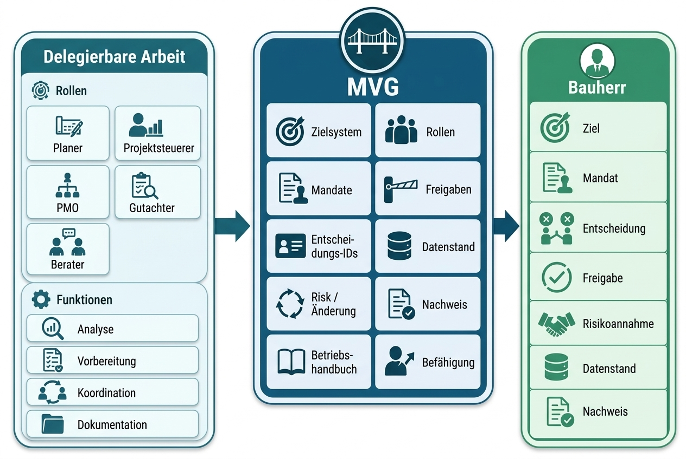

Arbeit kann delegiert werden; bauherrenseitige Legitimation nicht. Planer, Projektsteuerer, Gutachter, Projektmanagementbüro (PMO) und Berater können analysieren, vorbereiten, koordinieren und dokumentieren. Zielpriorisierung, Mandat, wesentliche Freigabe, Risikoannahme und Nachweisfähigkeit bleiben jedoch beim Bauherrn.

Minimum Viable Governance (MVG) bildet dafür den kleinsten funktionsfähigen Governance-Standard. Es verbindet Zielsystem, Rollen, Mandate, Freigaben, Entscheidungs-IDs, Datenstandslogik, Risiko- und Änderungssteuerung, Nachweisführung, Betriebshandbuch und Befähigung zu einem handhabbaren Führungsmodell. Der Nutzen liegt nicht in mehr Bürokratie, sondern in weniger Entscheidungsstau, klareren Eskalationswegen, belastbarer Gremienfähigkeit und einer nachvollziehbaren Nachweiskette.

Bauherr Mentoren übernimmt dabei keine Bauherrenrolle. BM stellt Struktur, Entscheidungsreife, Mandatsklarheit und Befähigung her, damit die Bauherrenorganisation ihre Verantwortung selbst wirksam ausüben kann. Der Ansatz richtet sich an Organisationen, die komplexe Vorhaben nicht nur berichten, sondern aktiv, nachweisbar und entscheidungsfähig führen müssen.

## Leitthese

Bauherren können Arbeit, Analyse, Koordination und Dokumentation delegieren. Nicht delegierbar bleibt die Legitimation von Ziel, Mandat, wesentlicher Entscheidung, Risikoannahme, Freigabe und Nachweis. MVG macht diese Verantwortung praktisch handhabbar.

## Managementaussagen

- Projektsteuerung unterstützt Kosten, Termine, Qualität, Koordination und Berichterstattung; sie ersetzt keine bauherrenseitige Entscheidung.

- MVG übersetzt Bauherrenverantwortung in Rollen, Mandate, Freigaben, Entscheidungs-IDs, Datenstandslogik, Eskalation, Betriebshandbuch und Befähigung.

- Entscheidungssicherheit entsteht durch den verbindlichen Zusammenhang von Zielsystem, Mandat, Datenstand, Risiko, Freigabe und Nachweis.

- Befähigung ist Pflichtbestandteil, weil der Bauherr das Modell nach Übergabe selbst anwenden können muss.

- LPH 0 ist ein wichtiger früher Hebel; maßgeblich ist jedoch die Entscheidungs- und Nachweisfähigkeit über den gesamten kritischen Projektverlauf.

## Ergebnisbild

Nach Umsetzung eines MVG-Ansatzes verfügt der Bauherr nicht über eine lose Sammlung einzelner Methoden, sondern über ein belastbares Führungs- und Entscheidungsmodell. Dieses Modell zeigt, welche Entscheidungen beim Bauherrn verbleiben, welche Vorbereitungsleistungen delegierbar sind, welche Mandate und Schwellen gelten, welche Unterlagen entscheidungsreif sein müssen und wie Entscheidungen nachvollziehbar in der Nachweiskette verankert werden.

| Element | Ergebnis |
|----|----|
| Bauherren-Mandats- und Verantwortungs­modell | Klärt Verantwortungsfelder, nichtdelegierbaren Kern, delegierbare Vorbereitung, Rollen, Schwellen und Eskalations­wege. |
| System der Entscheidungs-IDs | Gibt jeder wesentlichen Bauherrenentscheidung eine eindeutige Kennung, einen Datenstand, ein Mandat, einen Freigabeweg und einen Nachverfolgungsstatus. |
| Leistungsphasen- und Freigabemodell LPH 0–9 | Verbindet Projektfortschritt mit Entscheidungsvorbereitung, Freigabereife, Risikoannahme und Nachweisführung. |
| Standard für Entscheidungs­vorlagen | Sichert die Nachvollziehbarkeit von Entscheidungs­frage, Alternativen, Annahmen, Risiken, Datenstand, Empfehlung, Freigabe und Beschlusslage. |
| Betriebshandbuch | Übergibt Routinen, Rollen, Taktung, Fristen, Eskalations­wege und Betriebslogik in den Regelbetrieb. |
| Befähigung | Stellt sicher, dass Bauherren-Projektleitung, Auftraggeber Logik, PMO, Gremienrollen und Fachrollen das Modell selbst anwenden können. |

# Ausgangslage und Kernproblem

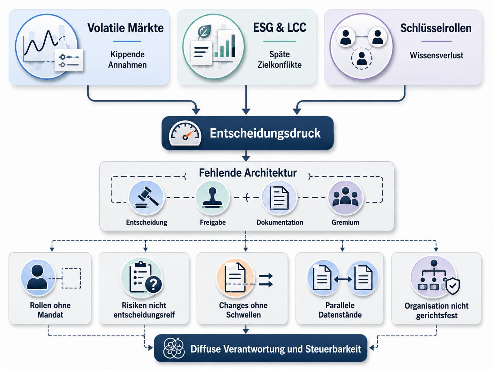

Komplexe Bauvorhaben stehen unterzunehmendem Entscheidungsdruck. Kosten, Termine, Qualität, Risiken, Umwelt-, Sozial- und Governance-Anforderungen (ESG), Lebenszykluskosten (LCC), Nutzerbedarfe, Beschaffungslogik, Gremienfähigkeit und Nachweisführung wirken nicht isoliert. Sie verdichten sich in konkreten Entscheidungssituationen: Was soll gebaut werden? Welche Variante trägt den Business Case – also die wirtschaftliche und strategische Entscheidungsgrundlage? Welche Risiken werden akzeptiert? Welche Änderung ist wesentlich? Welche Freigabe kann auf welchem Datenstand erteilt werden? Welche Entscheidung darf auf Projektebene getroffen werden, und für welche ist die Beschlussfassung durch den Bauherrn im Lenkungskreis oder die Rückkopplung an den Eigentümer erforderlich?

Je komplexer ein Vorhaben wird, desto weniger genügt es, Berichte zu sammeln und Abstimmungsrunden zu verdichten. Entscheidend ist, ob der Bauherr eine klare Führungs- und Entscheidungsarchitektur besitzt. Ohne diese Architektur entstehen Grauzonen: Rollen sind beschrieben, aber nicht mandatiert. Risiken sind bekannt, aber nicht entscheidungsreif. Änderungen werden bearbeitet, aber nicht mit Freigabeschwellen verbunden. Datenstände existieren parallel. Gremien erhalten Statusinformationen, aber keine klaren Entscheidungsfragen. Damit bleibt die Verantwortung formal beim Bauherrn – praktisch wird sie aber diffus.

## Volatile Märkte und Infrastrukturprogramme

Volatile Märkte treffen Bauprojekte über mehrere Kanäle: Preisannahmen, Lieferzeiten, Angebotsgültigkeiten, Komponenten mit langer Lieferzeit, Finanzierungspuffer, Vergabestrategie und Priorisierung im Projektportfolio. Besonders exponiert sind Vorhaben vor der finalen Investitionsentscheidung (FID) sowie im Zeitraum von Ausschreibung, Vergabe und Beschaffung von Komponenten mit langer Lieferzeit. Dort kippen Annahmen schnell, während Entscheidungsprozesse oft noch auf stabilere Umfelder ausgelegt sind.

Für Energieversorger, Netzbetreiber, Stadtwerkegruppen und andere Infrastrukturträger entsteht daraus ein spezifischer Governance-Bedarf: Freigabereife, Priorisierungsregeln, eine Logik für Fortführung oder Stopp, Frühwarnungen, eine konsequente Restkostenprognose (CTC), Nachtrags- und Änderungssteuerung sowie klare Eskalationsroutinen. Diese Elemente gehören zum Kern des Modells von Bauherr Mentoren.

## Steigende Komplexität durch ESG, LCC und Nachweislogik

Nachhaltigkeits-, Energie- und Klimaziele werden für Bauherren zunehmend zu Entscheidungsparametern. Lebenszykluskosten, Zertifizierungslogiken und das regulatorische Umfeld aus EU-Taxonomie, CSRD und EPBD erhöhen die Anforderungen an Zieldefinition, Variantenvergleich und Nachweisführung.

Für die Projektsteuerbarkeit bedeutet das: ESG und LCC dürfen nicht erst als späte Nachweise behandelt werden. Sie müssen früh in Zielsystem, Abwägungsregeln, Variantenentscheidungen und Freigaben – die verbindlichen Entscheidungspunkte des Projekts – integriert werden. Andernfalls werden Zielkonflikte erst sichtbar, wenn Planungsstände bereits weit fortgeschritten sind und Änderungen teuer werden.

## Wissensverlust und Schlüsselrollen

Komplexe Bauherrenorganisationen hängen in kritischen Momenten oft von wenigen erfahrenen Personen ab. Sind diese Personen nicht verfügbar, wurden Rollen nicht sauber delegiert oder ist Wissen nicht in Artefakte und Routinen übersetzt, steigt die organisatorische Verletzlichkeit. Der Engpass liegt dann in der fehlenden Wiederholbarkeit von Entscheidungen.

Ein belastbares Bauherren-Führungsmodell reduziert diese Abhängigkeit. Es macht nicht jede Organisation automatisch leistungsfähig, schafft aber einen gemeinsamen Standard: Wer entscheidet? Welche Unterlagen sind erforderlich? Welche Annahmen gelten? Welche Schwellen lösen eine Eskalation aus? Welche Entscheidungen müssen dokumentiert werden? So wird Erfahrung nicht ersetzt, aber in wiederholbare Führungslogik überführt.

## Warum Berichterstattung das Kernproblem nicht löst

Die naheliegende Reaktion auf Projektprobleme lautet oft: mehr Berichterstattung, mehr Abstimmung, mehr Gremienvorlagen, mehr Eskalationsrunden. Das kann in einzelnen Situationen helfen. Es löst aber nicht automatisch die Frage, wer was auf welcher Grundlage entscheiden darf und muss.

Berichterstattung erzeugt Information. Führung entsteht erst, wenn Information mit Mandat, Entscheidung, Schwelle, Risikoannahme, Datenstand, Freigabe und Nachweis verbunden wird. Ein Ampelbericht ohne Entscheidungsfrage bleibt Beobachtung. Ein Änderungsregister ohne Schwellenlogik bleibt Verwaltung. Eine Risikoübersicht ohne Risikoannahme bleibt Warnsignal. Eine Gremienvorlage ohne klare Entscheidungssituation bleibt Beschlussformalismus.

MVG setzt deshalb eine Stufe früher an. Es fragt nicht zuerst: Welche Berichte fehlen? Sondern: Welche nichtdelegierbaren Bauherrenentscheidungen müssen getroffen werden? Wer ist dafür letztverantwortlich? Welche Vorbereitung kann delegiert werden? Welche Mindestgrundlagen sind erforderlich? Welche Schwellen lösen Eskalation aus? Welcher Datenstand gilt? Wie wird der Beschluss später nachvollzogen?

## Symptome fehlender Ausübungsfähigkeit

<table style="width:100%;">
<colgroup>
<col style="width: 20%" />
<col style="width: 27%" />
<col style="width: 22%" />
<col style="width: 28%" />
</colgroup>
<thead>
<tr>
<th>Symptom</th>
<th>Typisches Muster</th>
<th>Konsequenz für den Bauherrn</th>
<th>MVG-Reaktion</th>
</tr>
</thead>
<tbody>
<tr>
<td>Unklare Zielprioritäten</td>
<td>Kosten, Termine, Qualität, ESG, Nutzeranforderungen und Risiko werden situativ gegeneinander ausgespielt.</td>
<td>Entscheidungen werden inkonsistent; spätere Korrekturen werden wahrscheinlicher.</td>
<td>Zielsystem, Muss-/Kann-Kriterien und Abwägungsregeln festlegen.</td>
</tr>
<tr>
<td>Rollen ohne Mandat</td>
<td>RACI (Rollen- und Zuständigkeitsmatrix) oder Organigramm existieren, aber Freigabe­schwellen, Stellvertretungen und Eskalations­wege fehlen.</td>
<td>Entscheidungen werden informell getroffen oder zu spät eskaliert.</td>
<td>RACI um Mandat, Schwelle, letztverantwortliche Rolle und Bezug zur Freigabe erweitern.</td>
</tr>
<tr>
<td>Gremien ohne Entscheidungs­ 
reife</td>
<td>Unterlagen sind umfangreich, aber Entscheidungs­frage, Optionen, Datenstand und Risiken sind nicht präzise genug.</td>
<td>Gremien vertagen, entscheiden unter Unsicherheit oder delegieren Verantwortung zurück.</td>
<td>Entscheidungsreife je Freigabe definieren und mit Entscheidungs-IDs verbinden.</td>
</tr>
<tr>
<td>Parallele Datenstände</td>
<td>Kosten, Termin, Projektumfang, Risiken und Annahmen werden in unterschiedlichen Fassungen geführt.</td>
<td>Entscheidungen beruhen auf widersprüchlichen Grundlagen.</td>
<td>Datenstands­logik, Versionierung und referenzierte Entscheidungs­grundlagen einführen.</td>
</tr>
<tr>
<td>Schleichende Risiko- und Änderungs­entwicklung</td>
<td>Risiken und Änderungen laufen parallel, ohne gemeinsame Priorisierung, Auswirkungsbewertung und Freigabeschwelle.</td>
<td>Projektumfang, Budget und Termine verschieben sich schleichend.</td>
<td>Risiko-/Änderungs-/Maßnahmensystem mit Entscheidungs­verknüpfungen und Schwellenlogik koppeln.</td>
</tr>
<tr>
<td>Prognosekonflikte</td>
<td>Kostenprognosen, Restkosten, Risikoreserve und Risiken werden unterschiedlich gelesen.</td>
<td>Entscheidungen zu Budget und Neufestlegung der Projektbasis werden politisch oder informell statt evidenzbasiert getroffen.</td>
<td>Prognosebericht, CTC-Entscheidungsanbindung und Neufestlegung der Projektbasis als Sonderformat außerhalb der regulären Freigabereihe etablieren.</td>
</tr>
<tr>
<td>Wissens-abhängigkeit</td>
<td>Kritisches Wissen liegt bei wenigen Personen und ist nicht in Routinen übersetzt.</td>
<td>Organisation wird verletzlich, sobald Rollen wechseln oder ausfallen.</td>
<td>Betriebshandbuch, Rollenlogik, Standardroutinen und Befähigung verankern.</td>
</tr>
<tr>
<td>Eskalation ohne Entscheidung</td>
<td>Themen werden nach oben gegeben, aber ohne klare Entscheidungsoptionen, Empfehlung oder Konsequenzen.</td>
<td>Eskalation erzeugt Verzögerung statt Führung.</td>
<td>Standard für Entscheidungs­vorlagen und Entscheidungs­frage je Eskalation verbindlich machen.</td>
</tr>
</tbody>
</table>

Diese Symptome sind zugleich der Prüfgegenstand der MVG-Reifegradanalyse (Abschnitt 7.1): Dort werden sie systematisch erhoben, bewertet und priorisiert. Bevor daraus ein Bauherren-Führungsmodell werden kann, braucht es allerdings begriffliche Klarheit: Was ist delegierbar – und was nicht? Diese Linie zieht das folgende Kapitel.

\
Begriffsrahmen – delegierbare Arbeit, Mandat und nichtdelegierbare Verantwortung
================================================================================

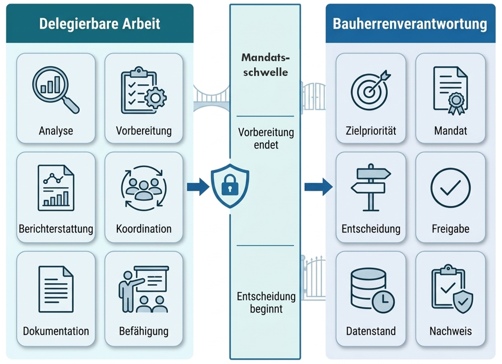

Der Begriff der nichtdelegierbaren Bauherrenverantwortung wird in diesem Whitepaper als Governance- und Führungsbegriff verwendet. Er bezeichnet jene Verantwortungen, bei denen der Bauherr zwar Unterstützung einkaufen, Vorbereitung delegieren und Dokumentation strukturieren lassen kann, die eigene Legitimation der Entscheidung aber nicht verliert.

Es geht nicht um einen abschließenden juristischen Pflichtenkatalog. Es geht um die organisatorische Frage, an welchen Stellen die Bauherrenorganisation selbst entscheidungsfähig bleiben muss. Genau diese Differenz ist für komplexe Bauprojekte entscheidend: Arbeit kann delegiert werden, Verantwortung muss ausübbar bleiben.

## Arbeitsdefinition

Nichtdelegierbare Bauherrenverantwortungen sind jene Verantwortungen, bei denen der Bauherr Zweck, Ziel, Mandat, wesentliche Entscheidung, Risikoannahme, Freigabe, Datenstand und Nachweis selbst legitimieren muss, auch wenn Analyse, Vorbereitung, Koordination und Dokumentation durch Dritte erfolgen.

Diese Definition ist bewusst governance-bezogen. Sie fragt nicht, welche einzelne Rechtsnorm in welcher Projektkonstellation gilt. Sie fragt, welche Führungsleistung beim Bauherrn verbleibt, damit Entscheidungen tragfähig, mandatiert, nachvollziehbar und organisationsfest werden.\
Zugleich benennt sie die sechs Verantwortungsfelder – Ziel, Mandat, wesentliche Entscheidung, Risikoannahme, Freigabe sowie Datenstand und Nachweis –, die Kapitel 4 im Einzelnen entfaltet.

## Delegierbar und nicht delegierbar

| Delegierbar | Nicht delegierbar |
|----|----|
| Analyse von Varianten, Kosten, Risiken, Terminfolgen, Qualität, ESG und LCC. | Festlegung, welche Zielpriorität gilt und welche Zielkonflikte wie aufgelöst werden. |
| Vorbereitung von Entscheidungs­vorlagen. | Entscheidung über Projektstart, wesentliche Freigabe, Neufestlegung der Projektbasis (erneute Abstimmung und Legitimation von Kosten-, Termin-, Risiko- und Projektumfangsgrundlagen), Fortführung oder Stopp, wesentliche Änderung oder Abbruch. |
| Koordination von Terminen, Unterlagen, Registern, Gesprächen, Arbeitssitzungen und Gremienvorlagen. | Festlegung von Mandaten, Freigabe­schwellen, Eskalations­wegen und verbindlichen Entscheidungs­rechten. |
| Berichterstattung, Prognoseerstellung, CTC-Berechnung, Terminbewertung und Datenaufbereitung. | Akzeptanz von Risikoexposition sowie Auswirkungen auf Kosten, Termin, Qualität, Projektumfang und ESG/LCC; Freigabe des Einsatzes der Risikoreserve. |
| Dokumentation von Besprechungen, Beschlüssen, Maßnahmen und Datenständen. | Sicherstellung, dass die Organisation auf belastbarer Grundlage entscheidet und die Beschlusslage nachweisbar bleibt. |
| Moderation, Strukturierung, Schulung und Befähigung. | Aufrechterhaltung der eigenen Bauherrenrolle und Steuerungsfähigkeit. |

Die Tabelle zeigt den Kern des MVG-Ansatzes: Nicht jede Tätigkeit muss beim Bauherrn liegen. Im Gegenteil. Professionelle Projekte brauchen Vorbereitung durch Fachrollen. Der Bauherr muss aber wissen, wo Vorbereitung endet und eigene Entscheidung beginnt.

## Die Verantwortungspyramide – Arbeitsebene, Mandatsebene und Letztverantwortung

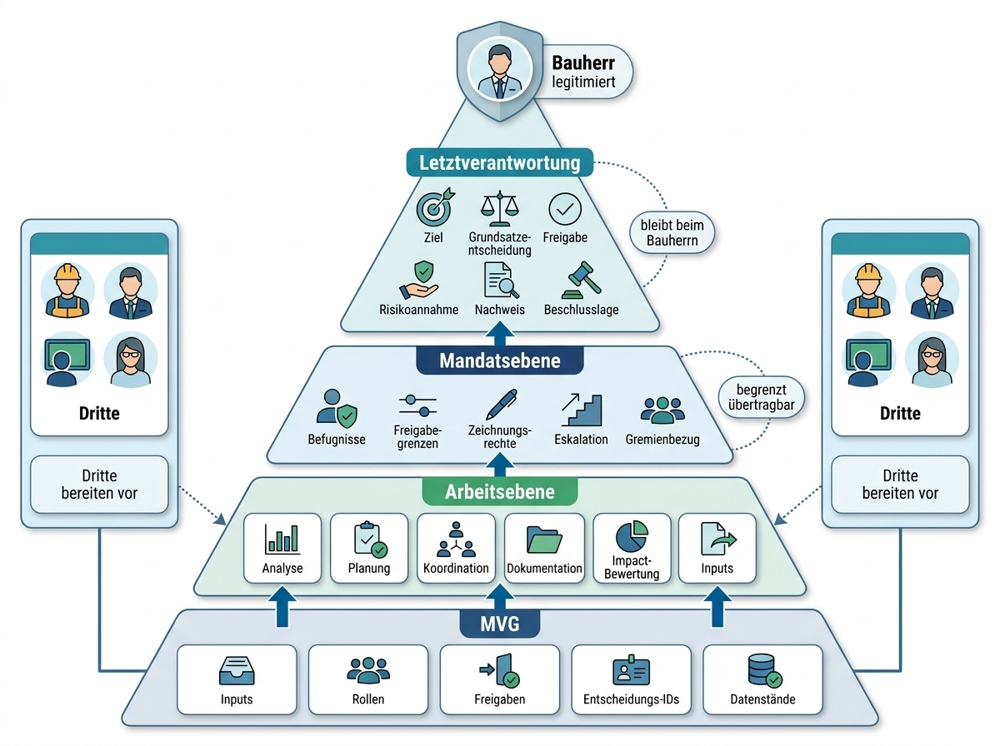

Für die praktische Umsetzung ist die Unterscheidung von drei Ebenen zentral.

| Ebene | Bedeutung | Relevanz für MVG |
|----|----|----|
| Arbeitsebene | Analyse, Planung, Koordination, Dokumentation, Auswirkungsbewertung, Unterlagenzusammenstellung und Nachverfolgung. | MVG definiert, welche Zuarbeiten wann, von wem und in welcher Qualität benötigt werden. |
| Mandatsebene | Befugnisse, Freigabegrenzen, Zeichnungsrechte, Stellvertretungen, Eskalationsschwellen und Gremienbezug. | MVG übersetzt Rollen in ein Mandatsmodell und verknüpft es mit Freigaben, Entscheidungs-IDs und Datenständen. |
| Letztverantwortung | Ziel, Grundsatzentscheidung, wesentliche Freigabe, Risikoannahme, Nachweis­fähigkeit und Beschlusslage. | MVG macht sichtbar, was der Bauherr selbst legitimieren und dokumentieren muss. |

Die Arbeitsebene kann in hohem Maß von Planern, Projektsteuerung, PMO, Gutachtern oder Beratern getragen werden. Die Festlegung des Mandats bleibt Bauherrenverantwortung; die Ausübung innerhalb klar definierter Schwellen kann jedoch an Rollen übertragen werden. Die Letztverantwortung bleibt dort, wo der Bauherr die bauherrenseitige Entscheidung selbst legitimieren muss. Damit ist der Begriffsrahmen komplett: Arbeits- und Mandatsebene lassen sich gestalten und delegieren – die Letztverantwortung nicht. Wie sie sich im Bauherrenalltag konkretisiert, zeigt das folgende Kapitel.

# Verantwortungsfelder des Bauherrn

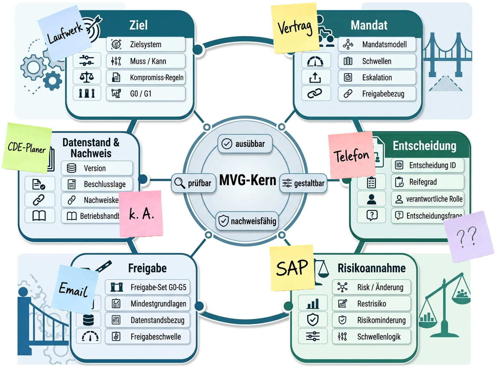

Nach der methodischen Grundlage stellt sich die Frage, welche Verantwortungsfelder im Bauherrenalltag konkret betroffen sind. Für MVG lassen sich sechs Felder unterscheiden. Sie bilden keine juristische Vollständigkeitsliste, sondern eine governance-bezogene Arbeitsstruktur, mit der Bauherr Mentoren die Ausübungsfähigkeit des Bauherrn sichtbar, prüfbar und gestaltbar macht.

<table>
<colgroup>
<col style="width: 17%" />
<col style="width: 20%" />
<col style="width: 1%" />
<col style="width: 19%" />
<col style="width: 20%" />
<col style="width: 20%" />
</colgroup>
<thead>
<tr>
<th>Feld</th>
<th>Nichtdelegierbarer Kern</th>
<th colspan="2">Delegierbare Vorbereitung</th>
<th>Typische Fehlstelle</th>
<th>MVG-Antwort</th>
</tr>
</thead>
<tbody>
<tr>
<td>Ziel</td>
<td>Projektzweck, Bedarf, Muss-/Kann-Kriterien, Zielprioritäten, Abwägungsregeln.</td>
<td colspan="2">Bedarfsanalysen, Varianten, Kosten-/Nutzenbewertung, ESG-/LCC-Zuarbeit, Nutzergespräche.</td>
<td>Zielkonflikte werden situativ gelöst; spätere Änderungen wirken wie Sachzwang.</td>
<td>Zielsystem, Entscheidungsgrundsätze, Abwägungsregeln, Freigabelogik für LPH 0–2</td>
</tr>
<tr>
<td>Mandat</td>
<td colspan="2">Entscheidungs­rechte, Freigabe­schwellen, Stellvertretungen, Eskalations­wege, Gremienbezug.</td>
<td>Rollenaufnahme, RACI-Vorschlag, Organigramm, Prozessanalyse, Gremienkalender.</td>
<td>Rollen sind beschrieben, aber nicht entscheidungsfähig mandatiert.</td>
<td>Bauherren-Mandats- und Verantwortungsmodell mit Schwellen und Bezug zur Freigabe.</td>
</tr>
<tr>
<td>Wesentliche Entscheidung</td>
<td colspan="2">Projektstart (LPH 0), Variantenwahl und Business Case (LPH 2), FID (LPH 3), Vergabe und Bindung einer Komponente mit langer Lieferzeit (LPH 7), Übergabe des Vorhabens (LPH 9), Neufestlegung der Projektbasis, Fortführung oder Stopp.</td>
<td>Entscheidungs­vorlagen, Auswirkungsanalysen, Optionen, Empfehlungen, Fachbewertungen</td>
<td>Entscheidungen werden vertagt, informell getroffen oder ohne klare Entscheidungs­frage vorbereitet.</td>
<td>System der Entscheidungs-IDs, Entscheidungs­reife, Standard für Entscheidungs­vorlagen.</td>
</tr>
<tr>
<td>Risikoannahme</td>
<td colspan="2">Akzeptanz von Risikoexposition, Restrisiko, Einsatz der Risikoreserve sowie Auswirkungen auf Kosten, Termin, Qualität, Projektumfang und ESG/LCC.</td>
<td>Risikoregister, Bewertung, Vorschläge zur Risikominderung, Szenarien, Sensitivitäten.</td>
<td>Risiken werden gelistet, aber nicht bauherrenseitig angenommen oder eskaliert.</td>
<td>Risiko-/Änderungs-/Maßnahmen­verknüpfung, Verknüpfungen zwischen Risiken und Entscheidungen, Schwellenlogik.</td>
</tr>
<tr>
<td>Freigabe</td>
<td colspan="2">Budget, Planung, Vergabe, Änderung, Neufestlegung der Projektbasis, Freigabe zum Abschluss der Leistungsphase und Übergabe des Vorhabens.</td>
<td>Unterlagenpakete, Prüfvermerke, Planungsstände, Freigabe­vorschläge, Gremienberichte.</td>
<td>Freigaben erfolgen auf unklarem Datenstand oder ohne Mandatsprüfung.</td>
<td>Leistungsphasen- und Freigabemodell LPH 0–9, Freigabeschwellen, Mindestgrundlagen, Datenstandsreferenz.</td>
</tr>
<tr>
<td>Datenstand und Nachweis</td>
<td colspan="2">Verbindlicher Datenstand, Annahmen, Versionen, Beschlusslage, Protokollstandard, Nachweiskette.</td>
<td>Datenpflege, Dokumentation, Protokolle, Annahmenregister, Unterlagenlenkung.</td>
<td>Parallele Datenstände und nicht reproduzierbare Entscheidungs­grundlagen.</td>
<td>Datenstands­logik, Standard für Entscheidungs­vorlagen, Nachweiskette, Betriebshandbuch.</td>
</tr>
</tbody>
</table>

## Ziel

Zielverantwortung bedeutet, dass der Bauherr entscheidet, was gebaut werden soll, warum es gebaut werden soll und welche Zielkonflikte wie aufgelöst werden. Varianten, Kostenmodelle, Nutzeranalysen, ESG-/LCC-Bewertungen und technische Alternativen können vorbereitet werden. Die Priorisierung bleibt Bauherrenaufgabe.

Ohne explizite Zielverantwortung entsteht im Projektverlauf eine schleichende Abweichung: Jede Rolle optimiert aus ihrer fachlichen Perspektive, aber niemand hält den Zielkonflikt zusammen. MVG verlangt deshalb ein Zielsystem mit Muss-Kriterien, verhandelbaren Kriterien, Abwägungsregeln und klarer Entscheidungslogik.

## Mandat

Mandatsverantwortung bedeutet, dass der Bauherr festlegt, wer welche Entscheidung vorbereiten, treffen, freigeben oder eskalieren darf. RACI unterscheidet dabei ausführungsverantwortliche, letztverantwortliche, konsultierte und informierte Rollen. Diese Zuordnung reicht allein nicht aus, wenn Freigabeschwellen, Stellvertretungen und Eskalationswege fehlen.

Ein wirksames Mandatsmodell beantwortet: Welche Entscheidung darf auf Projektebene getroffen werden? Welche Schwelle erfordert eine Entscheidung des Bauherrn oder die Beschlussfassung durch den Bauherrn im Lenkungskreis? Wer darf Kosten, Projektumfang, Termin, Risiko oder Vergabe beeinflussen? Welche Unterlagen müssen vorliegen? Welche Rolle ist letztverantwortlich? Genau diese Fragen verbindet MVG mit Freigaben und Entscheidungs-IDs.

Als Muster-Mandatsleiter gilt: Die Bauherren-PL gibt bis einschließlich 100 TEUR eigenständig frei; oberhalb von 100 TEUR bis einschließlich 5 Mio. EUR entscheidet das Änderungsgremium; darüber erfolgt die Beschlussfassung durch den Bauherrn im Lenkungskreis.

## Wesentliche Entscheidung

Nicht jede operative Entscheidung ist bauherrenseitig wesentlich. Wesentlich sind Entscheidungen, die Projektzweck, Zielsystem oder die Dimensionen Kosten, Termin, Qualität, Projektumfang, Risiko und ESG/LCC substanziell beeinflussen – insbesondere Variantenwahl, Business Case, FID, Vergabe, Neufestlegung der Projektbasis, Fortführung oder Stopp sowie die Übergabe des Vorhabens.

MVG macht diese Entscheidungen sichtbar. Das System der Entscheidungs-IDs verhindert, dass kritische Entscheidungen in Protokollen, E-Mails, Fachrunden oder informellen Abstimmungen verschwinden. Jede wesentliche Entscheidung erhält eine eindeutige Kennung, einen Datenstand, eine verantwortliche Rolle, eine Entscheidungsfrage und einen Nachverfolgungsstatus.

## Risikoannahme

Risiken können analysiert, bewertet und gemindert werden. Die Annahme wesentlicher Risikoexposition bleibt jedoch eine Bauherrenentscheidung. Das gilt insbesondere, wenn Risiken Kosten, Termin, Qualität, Projektumfang oder ESG/LCC beeinflussen.

MVG verknüpft Risiken mit Entscheidungen. Ein Risiko wird nicht nur als Eintrag geführt, sondern mit einer verantwortlichen Rolle, Frist, Wirkung, Risikominderung, Restrisiko, Entscheidungsbedarf und Eskalationsschwelle verbunden. Dadurch wird Risikoarbeit führungswirksam.

## Freigabe

Freigabe ist mehr als Unterschrift. Freigabe bedeutet bauherrenseitige Legitimation eines nächsten Schritts auf einem benannten Datenstand. Sie kann Planung, Vergabe, Budget, Änderung, Neufestlegung der Projektbasis, Bindung einer Komponente mit langer Lieferzeit, die Übergabe des Vorhabens oder den Regelbetrieb betreffen.

MVG bindet Freigaben an die Freigabelogik. Vor einer Freigabe muss klar sein, welche Entscheidung getroffen wird, welches Mandat gilt, welche Mindestgrundlagen vorliegen, welche Risiken angenommen werden und welcher Datenstand referenziert wird.

## Datenstand und Nachweis

Datenstand und Nachweis sind kein administratives Nebenprodukt. Sie sind ein eigenes Verantwortungsfeld. Eine formal richtige Entscheidung kann praktisch unbrauchbar werden, wenn unklar ist, welche Zahlen, Planstände, Annahmen, Risiken oder Protokolle zugrunde lagen.

MVG verlangt deshalb eine klare Datenstandslogik: Welche Version gilt? Welche Annahmen sind offen? Welche Änderungen wurden seit der letzten Freigabe aufgenommen? Welche Beschlusslage besteht? Wo wird die Nachweiskette geführt? Der Bauherr muss nicht alle Daten selbst pflegen, aber er muss sicherstellen, dass Entscheidungen auf belastbaren, benannten und reproduzierbaren Grundlagen beruhen. Damit sind die sechs Felder benannt, in denen der Bauherr entscheidungsfähig bleiben muss. Wie daraus ein funktionsfähiges Bauherren-Führungsmodell wird, zeigt das folgende Kapitel; die zugehörigen Ergebnisobjekte – vom Mandatsmodell bis zum Betriebshandbuch – bündelt Kapitel 9.

# Minimum Viable Governance als Bauherren-Führungsmodell

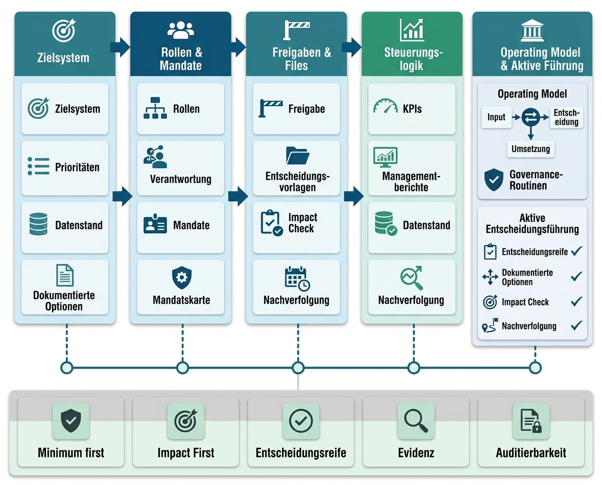

Minimum Viable Governance ist der kleinste funktionsfähige Governance-Standard, mit dem ein Bauherr komplexe Projekte wirksam führen kann. MVG ist weder Bürokratieprogramm noch Berichtsoffensive. Es ist ein Bauherren-Führungsmodell, das Verantwortung in entscheidbare, mandatsfähige und nachweisbare Strukturen übersetzt.

Ein Bauherren-Führungsmodell beantwortet sechs Kernfragen:

- Welche Ziele gelten?
- Wer darf was vorbereiten, entscheiden, freigeben oder eskalieren?
- Welche Entscheidungen sind wesentlich?
- Welche Risiken und Änderungen brauchen bauherrenseitige Annahme oder Freigabe?
- Welcher Datenstand gilt?
- Wie wird die Entscheidung später nachvollzogen?

Wirksam wird MVG erst, wenn diese Fragen nicht nur abstrakt beantwortet, sondern in Routinen, Freigaben, Entscheidungs-IDs, Datenstandslogik, Eskalationswege, Betriebshandbuch und Befähigung übersetzt werden. Damit entsteht aus Verantwortung eine praktisch nutzbare Führungslogik.

## Zweck von MVG

Der Zweck von MVG ist nicht maximale Governance. Der Zweck ist ausreichende Steuerbarkeit mit dem kleinstmöglichen funktionsfähigen Standard. Das unterscheidet MVG von schweren Governance-Programmen. MVG setzt nicht voraus, dass eine Organisation bereits reif, vollständig standardisiert oder systemseitig integriert ist. Es beginnt mit den Entscheidungen, die für den Bauherrn kritisch sind, und schafft dafür einen belastbaren Mindeststandard.

MVG zielt auf Entscheidungssicherheit. Entscheidungssicherheit bedeutet nicht Risikofreiheit. Sie bedeutet, dass Entscheidungen auf einem benannten Datenstand, mit klarer Entscheidungsfrage, bekannten Optionen, transparenten Annahmen, nachvollziehbarer Risikoannahme, definiertem Mandat und dokumentierter Beschlusslage getroffen werden.

## Bausteine des Bauherren-Führungsmodells

| MVG-Baustein | Funktion | Minimale Wirkung für den Bauherrn |
|----|----|----|
| Zielsystem und Abwägungsregeln | Legt fest, was Vorrang hat, wenn Kosten, Termine, Qualität, ESG, LCC, Risiko und Nutzwert kollidieren. | Verhindert situative Priorisierung und schafft eine belastbare Grundlage für Varianten- und Freigabeentscheidungen. |
| Rollen und Mandate | Übersetzt Rollen in Befugnisse, Schwellen, Stellvertretungen, Freigaben und Eskalations­wege. | Verhindert verdeckte Verantwortungsübernahme und unklare Entscheidungs­rechte. |
| Freigabelogik | Verknüpft Projektfortschritt mit Entscheidungsvorbereitung und Freigabereife. | Macht sichtbar, welche Entscheidungen vor welchem Schritt belastbar getroffen werden müssen. |
| System der Entscheidungs-IDs | Gibt wesentlichen Entscheidungen eine eindeutige Kennung und Nachverfolgungslogik. | Schafft Transparenz über offene, vorbereitete, getroffene und nachzuhaltende Entscheidungen. |
| Datenstands- und Nachweislogik | Definiert, welche Versionen, Annahmen und Beschlussgrundlagen gelten. | Reduziert parallele Wahrheiten und stärkt die Nachweiskette, Gremienfähigkeit und Nachvollziehbarkeit. |
| Risiko-/Änderungs-/Maßnahmen­verknüp-fung | Verbindet Risiken, Änderungen, Maßnahmen und Entscheidungen. | Verhindert, dass Risiken und Änderungen nur gelistet, aber nicht führungswirksam werden. |
| Betriebshandbuch | Beschreibt den Regelbetrieb mit Taktung, Rollen, Routinen, Eskalation und Verantwortlichkeiten. | Sichert den Übergang aus dem Projektaufbau in die wiederholbare Anwendung. |
| Befähigung | Macht Schlüsselrollen in der Bauherrenorganisation handlungsfähig. | Stellt sicher, dass der Bauherr das Modell selbst anwenden, prüfen und weiterentwickeln kann. |

Diese Bausteine kehren im weiteren Verlauf zweimal wieder: als anwendungsnahe Funktionslogiken des MVG Companion (Kapitel 6) und als konkrete Ergebnisse eines MVG-Mandats (Kapitel 9).

## Wirklogik: Verantwortung wird entscheidungsfähig

Die Wirkung von MVG entsteht durch Kopplung. Ein Zielsystem allein reicht nicht – ebenso wenig eine RACI-Matrix, ein Freigabekalender oder eine einzelne Entscheidungsvorlage. MVG wirkt erst, wenn diese Elemente miteinander verbunden werden.

Ein Beispiel: Eine wesentliche Änderungsentscheidung darf nicht nur als technischer Änderungsvorschlag erscheinen. Sie braucht eine Entscheidungs-ID, einen gültigen Datenstand, eine Auswirkungsbewertung auf Kosten, Termin, Qualität, Projektumfang, Risiko und ESG/LCC, eine Mandatsprüfung, eine Empfehlung, eine Freigabe- oder Eskalationslogik und einen Nachweis der Beschlusslage. Erst dann wird aus einer Änderung ein führbares Bauherrenthema.

Diese Kopplung verändert das Projektverhalten:

- Zielkonflikte werden vor Entscheidungen sichtbar.
- Mandate werden explizit, statt aus Hierarchie oder Gewohnheit angenommen.
- Freigaben werden an definierte Entscheidungsreife gebunden.
- Risiken und Änderungen werden entscheidungsfähig gemacht.
- Gremien erhalten Entscheidungsunterlagen statt reiner Statusberichte.
- Die Bauherren-Projektleitung erhält eine handhabbare Logik für Vorbereitung, Nachverfolgung und Eskalation.

## LPH 0 als früher Wirkungsraum

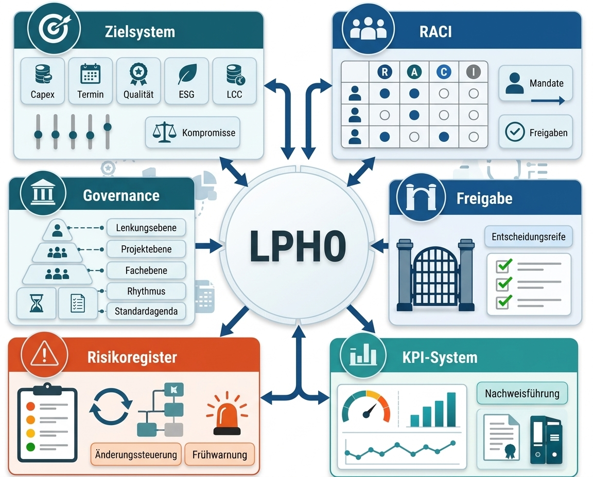

LPH 0 – die Bedarfsplanung im Sinne der DIN 18205, die den HOAI-Leistungsphasen 1–9 vorgelagert ist – bleibt ein wichtiger Wirkungsraum, weil dort Zielsystem, Mandatslogik, Leistungsphasen- und Freigabemodell, Datenstandslogik und erste Entscheidungsstandards früh angelegt werden können. Das Whitepaper setzt LPH 0 jedoch nicht als Hauptnarrativ. Der größere Punkt ist die Ausübungsfähigkeit nichtdelegierbarer Bauherrenverantwortung.

LPH 0 ist der Zeitpunkt, an dem spätere Steuerbarkeit vorbereitet werden kann. Wenn dort Zielprioritäten unklar bleiben, Mandate nicht definiert werden, Gremienlogik und Projektlogik auseinanderlaufen und Datenstände nicht referenziert werden, entstehen spätere Kosten-, Termin-, Qualitäts- und Freigaberisiken. MVG nutzt LPH 0 deshalb als frühen Hebel, bleibt aber nicht auf LPH 0 beschränkt. Auch in laufenden Projekten, vor wesentlichen Freigaben, bei Neufestlegungen der Projektbasis, bei schleichenden Änderungen oder im Rahmen einer MVG-Neuinitialisierung kann MVG die Entscheidungs- und Nachweisfähigkeit wiederherstellen.

## Abgrenzung und rechtlicher Hinweis

MVG behandelt nicht alle denkbaren Bauherrenpflichten. Es ist keine bauordnungsrechtliche Pflichtenmatrix, keine arbeitsschutzrechtliche Vertiefung, keine Vergaberechtsprüfung und keine technische Betreiberberatung. Der Fokus liegt auf Führungs-, Entscheidungs- und Nachweisfähigkeit. Damit ist der Rahmen des Modells abgesteckt. Wie MVG im Alltag der beteiligten Rollen ankommt, zeigt das folgende Kapitel zum MVG Companion.

# MVG Companion als Umsetzungsbeschleuniger

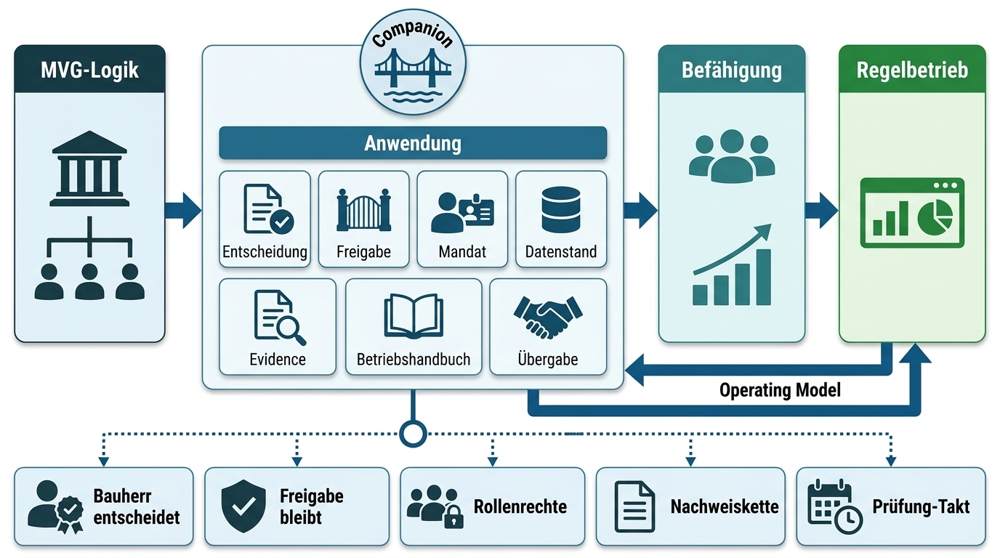

Der MVG Companion ist die anwendungsnahe Arbeitsumgebung zur Umsetzung von MVG. Er erleichtert den Übergang vom Konzept in die Anwendung und macht die MVG-Logik für die relevanten Rollen im Alltag verfügbar: bei der Vorbereitung von Entscheidungen, der Steuerung der Freigaben, der Nachweisführung, der Befähigung und beim Übergang in den Regelbetrieb.

Der Companion ist dabei kein zweites Dachkonzept neben MVG und kein Ersatz für Entscheidung oder Führung. Er ist die anwendungsnahe Begleitlogik, mit der MVG schneller verstanden, konsistenter angewendet und nachhaltiger verankert wird.

## Funktionslogiken des MVG Companion

Die folgenden Funktionslogiken spiegeln die Bausteine aus Abschnitt 5.2: Der Companion erfindet keine neue Governance, er macht die vereinbarte Governance im Alltag anwendbar.

| Funktionslogik | Beitrag zur Umsetzung | Nutzen für den Bauherrn |
|----|----|----|
| Entscheidungs­assistent | Führt durch Entscheidungsfrage, Mandat, Freigabe, Datenstand und Nachweis. | Schnellere und einheitlichere Entscheidungsvorbereitung. |
| Leitfaden für Freigaben | Erklärt Zweck der Freigabe, Mindestgrundlagen und typische Entscheidungs-IDs. | Klare Freigabereife ohne zusätzliche Abstimmungsschleifen. |
| Verantwortungs­zuordnung | Verknüpft Verantwortungsfeld, Rolle, Schwelle und Eskalation. | Mehr Transparenz über Vorbereitung, Entscheidung und Freigabe. |
| Daten- und Nachweisabfrage | Fragt Datenstand, Annahmen, Versionen und Nachweise ab. | Bessere Nachvollziehbarkeit und eine belastbare Nachweiskette. |
| Betriebshandbuch-Assistent | Überführt Routinen, Taktung, verantwortliche Rollen und Prüfungen in die Anwendung. | Stabilerer Regelbetrieb nach Übergabe. |
| Rolleneinführung | Unterstützt Schulungen und Rollenübergaben. | Schnellere Befähigung neuer oder wechselnder Rollen. |
| MVG-Übergabeassistent | Führt offene Punkte, Betriebslogik und Prüfzyklen zusammen. | Strukturierter Übergang aus Beratungsmandat in Eigenbetrieb. |

## Befähigung mit Unterstützung des MVG Companion

Mit dem Companion wird Befähigung von der einmaligen Schulung zur wiederholbaren Anwendungskette: Schulung, Pilotierung, Übergabe und Regelbetrieb greifen auf dieselbe Logik zurück. Rollen lernen nicht nur Begriffe, sondern wenden Entscheidungs-IDs, Freigabefragen, Mandatslogik, Datenstandsprüfung und Routinen des Betriebshandbuchs in konkreten Entscheidungssituationen an.

| Befähigungsschritt | Companion-Beitrag | Ergebnis |
|----|----|----|
| Schulung | Rollenführung, Beispiele und Anwendungspfade. | Gemeinsames Verständnis der MVG-Logik. |
| Pilotierung | Begleitung realer Entscheidungen und Freigabevorbereitung. | Kalibrierte Schwellen und praxistaugliche Routinen. |
| Übergabe | Betriebshandbuch-Assistent, offene Punkte, Prüfrhythmus. | Geordnete Übergabe in die Bauherrenorganisation. |
| Regelbetrieb | Wiederkehrende Anwendungshilfe für Entscheidungen, Freigaben und Prüfungen. | Dauerhaft verfügbare Anwendungslogik. |

## Rahmenbedingungen und Datenstand

<table>
<colgroup>
<col style="width: 100%" />
</colgroup>
<thead>
<tr>
<th>
Rahmenbedingungen

Der MVG Companion ersetzt keine Bauherrenentscheidung, keine Gremienfreigabe, keine Rechtsberatung, keine Fachplanung und keine Projektsteuerung. Seine Funktion liegt in Strukturierung, Orientierung, Anwendungshilfe und Befähigung. Verbindlich bleiben freigegebene Datenstände, definierte Rollenrechte, Datenschutzanforderungen und die bauherrenseitige Legitimation der Entscheidung.
</th>
</tr>
</thead>
<tbody>
</tbody>
</table>

Der MVG Companion ist ein lokal lauffähiges, browserbasiertes Governance-Arbeitsbuch. Er dient als optionales Arbeitsmittel, um MVG-Logik für Entscheidungen, Freigaben, Nachweise, Schulung und Übergabe anwendungsnah verfügbar zu machen. Der Companion führt keine Entscheidung herbei und ersetzt keine verbindlichen Systeme, Rollenrechte oder Freigaben des Bauherrn.

Praktisch kann der MVG Companion vorhandene Strukturen einer zentralen Datenquelle abbilden oder referenzieren, etwa über eine projektübergreifende Sicht, eine Projekt-Steuerungsübersicht, Entscheidungsvorlagen, Risiko-, Frühwarnungs-, Änderungs- und Maßnahmenregister, das Freigaberegister, RACI und Mandate, den Governance-Kalender, Managementberichte sowie Übergabe und Betriebshandbuch. Führend bleiben die vom Bauherrn freigegebenen Datenquellen und Dokumentenstände.

Der MVG Companion ist ein optionales Arbeitsmittel und für Beratungskunden kostenfrei; es fällt kein separates Lizenzentgelt an, und es bestehen unbegrenzte Nutzungsrechte auch nach Mandatsende. Abgrenzung: keine Einführung von Drittsoftware und keine Bereitstellung von Software als Dienst (SaaS); die Bereitstellung des MVG Companions ist ein methodisches Arbeitsmittel innerhalb der Beratung. Das Bauherren-Führungsmodell funktioniert unabhängig davon mit vorhandenen Büro- und Projektwerkzeugen.

Für den Companion gilt eine klare Datenstandslogik: Er arbeitet mit benannten, versionierten und zugriffsberechtigten Informationen. Ergebnisse sind Entscheidungsunterstützung und werden vor Verwendung in Freigaben oder Gremien durch die zuständigen Rollen geprüft.

## Zusammenarbeit im MVG Companion

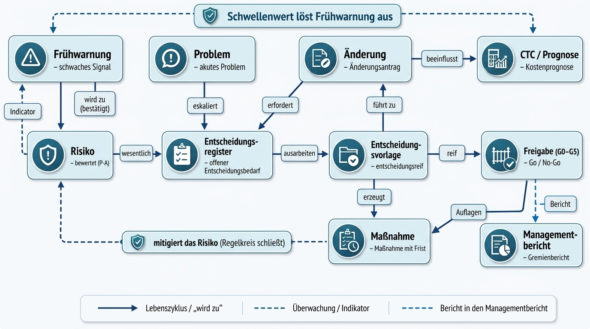

Governance wirkt nur, wenn Register, Rollen und Taktung eindeutig zusammenarbeiten. Diese kompakte Ansicht beschreibt, wer welches Register pflegt, wie Themen durch den Governance-Fluss laufen und wann Eskalation oder Entscheidung erforderlich wird. Der Zweck ist nicht zusätzliche Bürokratie, sondern ein gemeinsamer Arbeitsstandard für verantwortliche Rollen, Projektleitung, PMO, Controlling und Lenkungskreis.

###  Grundlogik der Zusammenarbeit

Jedes Register hat eine verantwortliche Rolle, einen Pflegezyklus und einen definierten nächsten Schritt.

Die RACI-Logik klärt je Prozess: ausführungsverantwortlich, letztverantwortlich, konsultiert und informiert.

Entscheidungsbedürftige Themen werden nicht nur berichtet, sondern über das Entscheidungsregister und eine Entscheidungsvorlage entscheidungsreif gemacht.

Der Managementbericht – der aggregierte Gremienbericht – ist der gemeinsame Sammelpunkt für Gremien; das Entscheidungsregister ist nur die Warteschlange für echte Entscheidungen.

### Registerpflege und Takt

| Registergruppe | Verantwortliche Rolle | Turnus |
|----|----|----|
| Entscheidungsregister, Änderungsregister, Freigaberegister | Bauherren-PL | laufend / anlassbezogen; Änderungsgremium monatlich, zzgl. anlassbezogener Sondersitzungen |
| Risikoregister, Frühwarnungsregister | Projektsteuerung | monatlich (Prüfung); wöchentliche Sichtung |
| Maßnahmenregister, Problemregister, Governance-Kalender, Protokolle | PMO | wöchentlich bis monatlich |
| CTC und Prognose, Kostengruppen DIN 276, Schwellenwerte | Controlling | monatlich |
| Nachweise und Verknüpfungen, Übergabe / Betriebshandbuch | PMO mit Fachrollen | anlassbezogen |

### Kanonischer Governance-Fluss

**EW (unbewertetes Signal) → bestätigt → Risiko → Entscheidung → Freigabe → Maßnahme → Managementbericht**

Eine Frühwarnung (EW) ist ein unbewertetes Signal. Wird sie bestätigt, wird daraus ein bewertetes Risiko. Aus Risiken, Änderungen oder Problemen kann Entscheidungsbedarf entstehen; CTC- oder Schwellenwertverletzungen erzeugen neue Frühwarnungen als neue Signale, nicht als Rückrichtung aus einem bestehenden Risiko. Die Entscheidungsvorlage bündelt Frage, Datenstand, Optionen, Bewertung und Empfehlung. Beschlüsse werden anschließend als Maßnahmen mit einer verantwortlichen Rolle und einer Frist nachverfolgt.

### Register-Abgrenzung

| Register | Bedeutung | Nächster Schritt |
|----|----|----|
| Frühwarnung | unbewertetes Signal | bestätigen; bei Bestätigung Risiko |
| Risikoregister | bewertetes mögliches Ereignis | Risikominderung oder Entscheidung |
| Problemregister | eingetretenes Problem | Maßnahme, ggf. Entscheidung |
| Änderungsregister | gewollte Änderung | Auswirkung, Freigabeweg |
| Entscheidungsregister | offener Entscheidungsbedarf | Entscheidungsvorlage |
| Freigabe | Entscheidung des Bauherrn am Abschluss der Leistungsphase | Status und Freigabeentscheidung dokumentieren |
| Management­bericht | aggregierter Gremienbericht | Information und Beschlussvorbereitung |

Die Statusbegriffe bleiben vom Freigabeprozess getrennt: Entscheidungen – Offen · In Bearbeitung · Entscheidungsreif · Entschieden · Verworfen; Risiken – aktiv · beobachtet · gemindert · geschlossen; Änderungen – Beantragt · In Prüfung · Beschlossen · Abgelehnt · Umgesetzt; Freigaben – Status offen → in Vorbereitung → abgeschlossen und Ergebnis Freigabe / keine Freigabe / Freigabe mit Auflagen.

### Rhythmus, Rollen und Eskalation

| Rhythmus | Beteiligte | Fokus |
|----|----|----|
| täglich | verantwortliche Rollen, PMO | Maßnahmen, Probleme, Fristen |
| wöchentlich | Bauherren-PL, Projektsteuerung, verantwortliche Rolle | wöchentliche Risikosichtung im regelmäßigen Abstimmungstermin; offene Entscheidungen und Maßnahmen |
| monatlich | Projektsteuerung | formale Risikoprüfung und Bericht → Management­bericht |
| monatlich, zzgl. anlassbezogener Sondersitzungen | Bauherren-PL, Änderungsgremium | Änderungen bewerten und entscheiden |
| monatlich | Bauherren-PL, Controlling, PMO | CTC und Prognose, Management­bericht |
| je Freigabe | Bauherr – er erteilt jede Freigabe selbst auf Vorlage der Bauherren-PL; der Lenkungskreis berät und bereitet vor | Status offen → in Vorbereitung → abgeschlossen; Entscheidung Freigabe / keine Freigabe / Freigabe mit Auflagen |

Innerhalb des Mandats entscheiden die verantwortliche Rolle und die Bauherren-PL im definierten Rahmen und dokumentiert im Register. Bei Überschreitung von Wert-, Risiko-, Frist- oder Mandatsschwellen wird entlang der Mandatsleiter an die Bauherren-PL, das Änderungsgremium oder zur Beschlussfassung durch den Bauherrn im Lenkungskreis eskaliert. Eskalation ist kein Fehlerbild, sondern Teil der Steuerungslogik. Companion und Bauherren-Führungsmodell brauchen allerdings einen geordneten Weg in die Organisation. Diesen Weg beschreibt die Leistungsarchitektur von Bauherr Mentoren im folgenden Kapitel.

# Leistungsarchitektur von Bauherr Mentoren

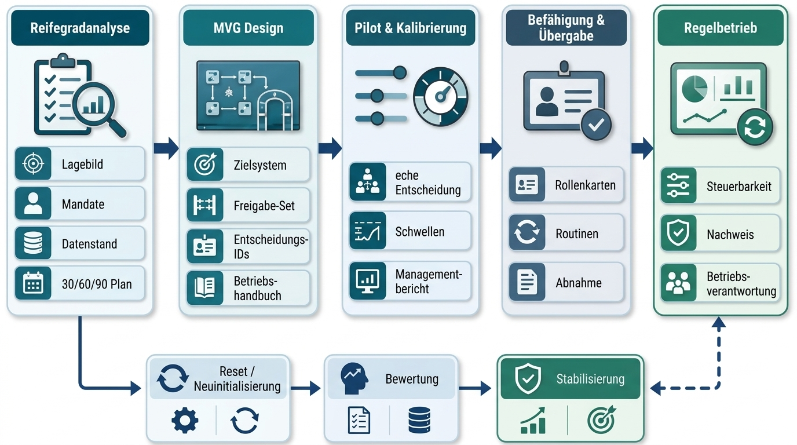

Auf dieser Grundlage beschreibt die Leistungsarchitektur von Bauherr Mentoren den Weg von der Diagnose zur Anwendung. Sie ist kein Methodenbaukasten und keine Sammlung einzelner Spezialleistungen. Sie zeigt, wie die Bauherrenorganisation ihre nichtdelegierbaren Verantwortungen sichtbar, entscheidungsfähig, nachweisbar und dauerhaft ausübbar macht.

Der Umsetzungspfad folgt einer einfachen Logik: Diagnose, Konzeption, Pilotierung, Befähigung und Übergang in den Regelbetrieb. Für laufende Projekte mit eingeschränkter Steuerbarkeit kommt die MVG-Neuinitialisierung als gezieltes Sonderformat hinzu.

- MVG-Reifegradanalyse

<!-- -->

- MVG-Konzeption

<!-- -->

- Pilotierung und Kalibrierung

<!-- -->

- Befähigung und Übergabe

<!-- -->

- MVG-Neuinitialisierung

## MVG-Reifegradanalyse

Die MVG-Reifegradanalyse ist der Einstieg in die neue Leistungsarchitektur. Sie erzeugt typischerweise in 2–4 Wochen ein evidenzbasiertes Lagebild zur Ausübungsfähigkeit des Bauherrn und liefert eine Bewertungsmatrix, Governance-Lücken, eine Entscheidungsliste sowie einen 30/60/90-Tage-Plan. Im Mittelpunkt steht nicht die Frage, ob Projektunterlagen vollständig wirken, sondern ob die Bauherrenorganisation ihre wesentlichen Entscheidungen, Mandate, Risikoannahmen, Freigaben, Datenstände und Nachweise ausreichend beherrscht.

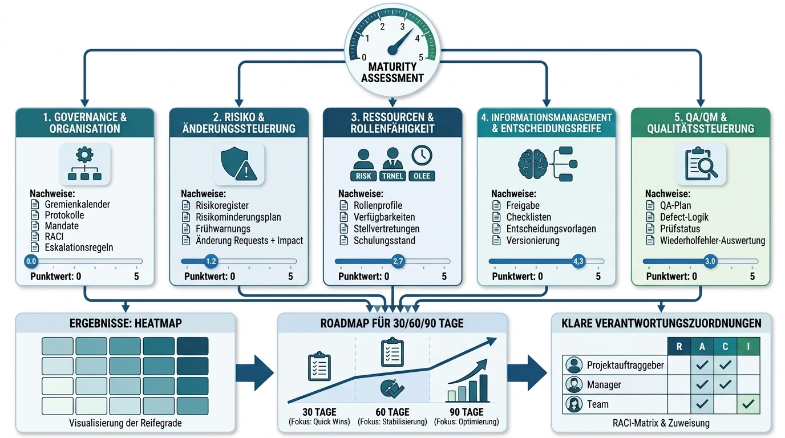

Die Reifegradbewertung der MVG-Reifegradanalyse bewertet die 10 MVG-Domänen mit 49 Fragen in der Logik Ja = 100, Teilweise = 50 und Nein = 0 auf einer Skala von 0–100. Die Lesart lautet: \< 55 kritisch, 55–79 mit Lücken, ≥ 80 steuerbar. Die sechs Verantwortungsfelder strukturieren als Kernmodell die Bauherrenverantwortung; gemessen wird ausschließlich über die 10 Domänen. Die zehn Domänen sind mitsamt ihren Prüffragen im Erhebungsinstrument der MVG-Reifegradanalyse dokumentiert.

| Aspekt | Beschreibung |
|----|----|
| Zweck | Schnelles Lagebild der bauherrenseitigen Entscheidungs- und Nachweis­fähigkeit. |
| Typische Ausgangslage | Unklare Mandate, Entscheidungsstau, divergierende Datenstände, Brüche bei Freigaben sowie schleichende Risiko- oder Änderungsentwicklungen. |
| Zentrale Arbeitsfragen | Welche Entscheidungen sind kritisch? Welche Verantwortung bleibt beim Bauherrn? Welche Mandate fehlen? Welche Datenstände sind widersprüchlich? Welche Entscheidungen sind noch nicht entscheidungsreif? |
| Typische Ergebnisse | Bewertungsmatrix, wichtigste Risiken, Verantwortungslücken, Entscheidungsliste, 30/60/90-Tage-Plan. |
| Rolle des Bauherrn | Benennung einer verantwortlichen Rolle, Bereitstellung der Kernunterlagen, Teilnahme an Gesprächen und am Management­bericht, Entscheidung über Prioritäten. |
| Rolle von Bauherr Mentoren | Diagnose, Strukturierung, Moderation, Verdichtung, Empfehlung und priorisierte Umsetzungslogik. |

## MVG-Konzeption

Die MVG-Konzeption übersetzt den Befund in ein konkretes Bauherren-Führungsmodell. Sie definiert Zielsystem, Mandatsmodell, Leistungsphasen- und Freigabemodell, System der Entscheidungs-IDs, Datenstandslogik, Eskalation, Risiko-/Änderungs-/Maßnahmenverknüpfung und die Logik des Betriebshandbuchs.

| Aspekt | Beschreibung |
|----|----|
| Zweck | Entwurf eines belastbaren Mandats-, Rollen-, Freigabe- und Entscheidungsmodells. |
| Typische Ausgangslage | Diagnose liegt vor; die Organisation braucht ein funktionsfähiges Mindestmodell. |
| Zentrale Arbeitsfragen | Welche Freigaben sind für das Projekt verbindlich? Welche Entscheidungen sind wesentlich? Welche Schwellen gelten? Welche Datenstände müssen je Entscheidung referenziert werden? |
| Typische Ergebnisse | Zielsystem, Mandatsmodell, Leistungsphasen- und Freigabemodell, System der Entscheidungs-IDs, Datenstandslogik, Eskalationslogik, Struktur des Betriebshandbuchs. |
| Rolle des Bauherrn | Entscheidung über Zielprioritäten, Mandate, Schwellen, das Leistungsphasen- und Freigabemodell sowie die Regelbetriebslogik. |
| Rolle von Bauherr Mentoren | Konzeption, Strukturierung, Entscheidungsmoderation, Konsolidierung und Operationalisierung. |

## Pilotierung und Kalibrierung

Pilotierung und Kalibrierung erproben das MVG-Modell an realen Entscheidungen, Freigaben, Risiken oder Änderungen. Die Pilotierung ist notwendig, weil Governance nicht nur auf Papier funktionieren darf. Erst im echten Entscheidungsfall zeigt sich, ob Schwellen praktikabel, Datenstände belastbar, Mandate klar und Gremienunterlagen entscheidungsfähig sind.

| Aspekt | Beschreibung |
|----|----|
| Zweck | Test des Modells an realen Entscheidungs- und Freigabesituationen. |
| Typische Ausgangslage | Entwurf des Bauherren-Führungsmodells liegt vor, muss aber praktisch kalibriert werden. |
| Zentrale Arbeitsfragen | Funktionieren Entscheidungs-IDs? Sind die Freigabeanforderungen angemessen? Sind Schwellen verständlich? Können Gremien entscheiden? |
| Typische Ergebnisse | Berichte zur Pilotierung, kalibrierte Schwellen, angepasste Routinen, Erkenntnisse, Abnahmevorschlag. |
| Rolle des Bauherrn | Anwendung im echten Entscheidungsfall, Rückmeldung, Freigabe von Anpassungen. |
| Rolle von Bauherr Mentoren | Begleitung, Beobachtung, Kalibrie­rung, Moderation und Konsolidierung der Lernergebnisse. |

## Befähigung und Übergabe

Befähigung und Übergabe sind Pflichtbestandteile eines vollständigen MVG-Mandats, weil das Bauherren-Führungsmodell nach Abschluss des Mandats in der Bauherrenorganisation tragfähig weiterlaufen muss.

Befähigung richtet sich an Bauherren-Projektleitung, Auftraggeberlogik, PMO, Projektsteuerung, Gremienrollen und ausgewählte Fachrollen. Sie stellt sicher, dass Rollen nicht nur wissen, welche Dokumente existieren, sondern wie sie Entscheidungen vorbereiten, Schwellen anwenden, Datenstände referenzieren, Risiken eskalieren und Freigaben nachhalten.

| Aspekt | Beschreibung |
|----|----|
| Zweck | Verankerung des MVG-Modells in Schlüsselrollen und Übergabe in den Regelbetrieb. |
| Typische Ausgangslage | Das Bauherren-Führungsmodell ist definiert und in der Pilotierung erprobt, aber noch nicht stabil in Routinen überführt. |
| Zentrale Arbeitsfragen | Wer betreibt das Modell? Wer pflegt welche Routine? Wie werden neue Entscheidungen aufgenommen? Wie wird nachjustiert? |
| Typische Ergebnisse | Schulungen, Rollenkarten, Betriebshandbuch, Verbesserungsvorrat, Übergabebericht, Abnahmekriterien. |
| Rolle des Bauherrn | Übernahme der Betriebsverantwortung, Benennung der Rollen, Teilnahme an Befähigungsmaßnahmen und Prüfungen. |
| Rolle von Bauherr Mentoren | Schulung, Praxisbegleitung, Übergabe, Qualitätssicherung und Abschlussbericht. |

## MVG-Neuinitialisierung

Die MVG-Neuinitialisierung ist ein Sonderformat für laufende Projekte mit eingeschränkter Steuerbarkeit. Sie bedeutet keinen vollständigen Projektneustart, sondern eine gezielte Neuordnung der Steuerungs- und Entscheidungslogik. Kapitel 11 vertieft die typischen Auslöser, die neu zu ordnenden Felder und das Ergebnisbild einer MVG-Neuinitialisierung.

| Aspekt | Beschreibung |
|----|----|
| Zweck | Wiederherstellung belastbarer Steuerungs-, Entscheidungs- und Nachweis­fähigkeit. |
| Typische Ausgangslage | Projekt läuft, aber Entscheidungslogik, Datenstände, Prioritäten oder Mandate sind nicht mehr tragfähig. |
| Zentrale Arbeitsfragen | Welche Entscheidungen müssen neu legitimiert werden? Welche Datenstände gelten? Welche Freigaben müssen in der Folge nachgeholt oder wiederholt werden? Welche Prioritäten sind neu zu setzen? |
| Typische Ergebnisse | Governance-Lagebild, Neuordnung offener Entscheidungen, Logik zur Neufestlegung der Projektbasis, Eskalationsplan, stabilisierter Regelbetrieb. |
| Rolle des Bauherrn | Entscheidung über den Auftrag zur MVG-Neuinitialisierung, Prioritäten, Neufestlegung der Projektbasis, Freigaben und eine neue Mandatslogik. |
| Rolle von Bauherr Mentoren | Strukturierung, Konzeption der MVG-Neuinitialisierung, Moderation, Entscheidungslogik, Übergabe und Stabilisierung. |

## Leistungsgrenzen

Bauherr Mentoren übernimmt keine operative Dauer-Projektsteuerung und keine Linienfunktion. BM ersetzt keine Bauherrenentscheidung, keine Gremienentscheidung, keine Fachplanung, keine Bauleitung, keine Objektüberwachung und keine Rechtsberatung. BM übernimmt keine Einführung von Drittsoftware und erbringt keine SaaS-Leistungen; die Bereitstellung des MVG Companions ist ein methodisches Arbeitsmittel innerhalb der Beratung. BM liefert Struktur, Entscheidungsreife, Mandatsklarheit, Nachweislogik, Befähigung und Übergang in den Regelbetrieb.

| Rolle | Kann leisten | Darf nicht ersetzen |
|----|----|----|
| Bauherr Mentoren | Diagnose, Konzeption, Moderation, Strukturierung, Pilotierung, Befähigung, Übergabe. | Bauherrenentscheidung, Linienfunktion, Rechtsberatung, Projektsteuerung im Regelbetrieb. |
| Bauherren-PL | Vorbereitung, Koordination, Entscheidungsregister, Eskalation, Nachverfolgung. | Entscheidung des Bauherrn bzw. Beschlussfassung durch den Bauherrn im Lenkungskreis oberhalb der eigenen Schwelle. |
| PMO und Projektsteuerung | Daten, Takt, Register, Management­berichte, Fortschritts- und Maßnahmenverfolgung. | Zielpriorisierung, Risikoannahme, wesentliche Freigabe ohne Mandat. |
| Planung / Fachberatung | Varianten, technische Nachweise, Auswirkungsanalysen, Fachunterlagen. | Bauherrenseitige Abwägung und Freigabeentscheidung. |
| Recht / Vergabe | Prüfung, Regelkonformität sowie vergabe- und vertragsbezogene Einschätzung. | Bauherrenseitige Abwägung, Vergabeentscheidung und operative Bauherrenführung. |

Wie diese Leistungspakete zeitlich ineinandergreifen und woran ihr Erfolg gemessen wird, zeigt das folgende Kapitel.

# Implementierung – von Diagnose zu Regelbetrieb

MVG wird sequenziert eingeführt. Der Ansatz ist bewusst pragmatisch. Er beginnt mit einem Lagebild, übersetzt dieses in ein funktionsfähiges Mindestmodell, testet das Modell an echten Entscheidungen und übergibt es anschließend in den Regelbetrieb.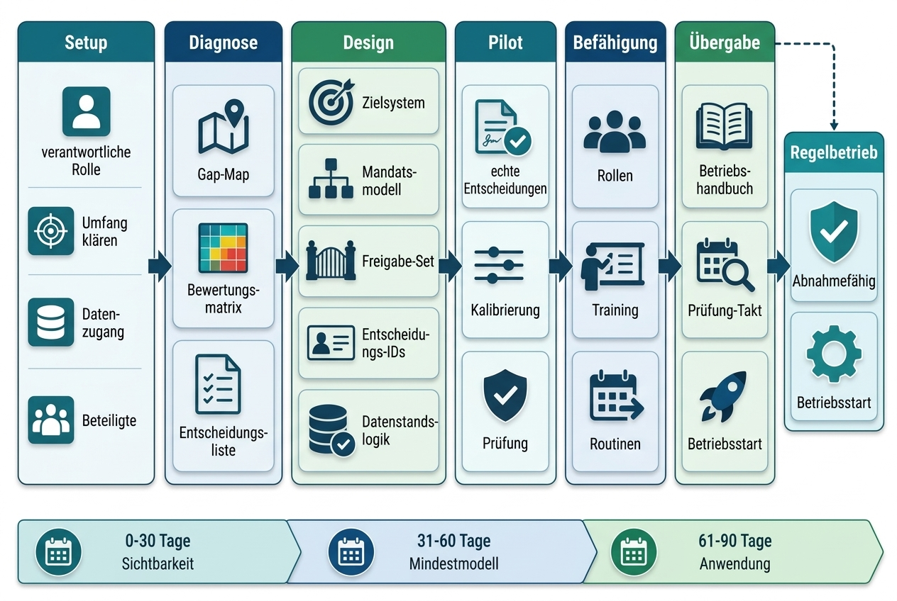

## Sequenziertes Vorgehen

| Vorgehensschritt | Zweck | Kernaktivitäten | Ergebnisse | Mitwirkung | Abnahme |
|----|----|----|----|----|----|
| Einrichtung | Auftrag, Leistungsumfang und Datenzugang klären. | Auftragsklärung, Übersicht der Beteiligten, Datenanforderung, Gesprächsplan, Projektkontext. | Bestätigter Leistungsumfang, Datenliste, Terminplan. | Verantwortliche Rolle benennen, Unterlagenzugang sichern, Gesprächspartner bestätigen. | Leistungsumfang und Vorgehen bestätigt. |
| Diagnose | Ausübungsfähigkeit des Bauherrn prüfen. | Dokumentenprüfung, Gespräche, Sichtung der Entscheidungen, Mandats- und Datenstandsprüfung. | Bewertungsmatrix, Governance-Lücken, wichtigste Risiken, Entscheidungsliste, 30/60/90-Tage-Plan. | Gespräche, Management­bericht, Priorisierung. | Befund und Prioritäten bestätigt. |
| Konzeption | Bauherren-Führungsmodell entwerfen. | Zielsystem, Mandate, Leistungsphasen- und Freigabemodell, Entscheidungs-IDs, Datenstandslogik, Eskalationswege, Struktur des Betriebshandbuchs. | Entwurf des Bauherren-Führungsmodells, Leistungsphasen- und Freigabemodell, Mandatsmodell, System der Entscheidungs-IDs. | Entscheidungen zu Mandaten, Schwellen, Freigaben und Rollen. | Entwurf abgenommen oder mit Auflagen bestätigt. |
| Pilotierung und Kalibrie­rung | Modell an echten Entscheidungen testen. | Anwendung auf ausgewählte Entscheidungen, Freigaben, Risiken oder Änderungen; Prüfung der Praktikabilität. | Berichte zur Pilotierung, kalibrierte Schwellen, Erkenntnisse. | Anwendung im realen Projekt, Rückmeldung, Freigaben. | Pilotierung erfolgreich oder Anpassungsbedarf definiert. |
| Befähigung | Schlüsselrollen handlungsfähig machen. | Schulungen, Rollenklärungen, Entscheidungsübungen, Regelbetriebslogik. | Befähigte Rollen, Verbesserungsvorrat, Vorbereitung der Übergabe. | Teilnahme der Schlüsselrollen, Übernahme der Routinen. | Rollen können Modell anwenden. |
| Übergabe | Übergabe in den Regelbetrieb. | Betriebshandbuch finalisieren, offene Punkte übergeben, Prüfrhythmus festlegen. | Betriebshandbuch, Übergabebericht, Betriebsstart. | Abnahme erteilen, die verantwortliche Rolle für den Regelbetrieb benennen und den Prüfzyklus bestätigen. | Regelbetrieb freigegeben. |

## 30/60/90-Tage-Logik

Die 30/60/90-Tage-Logik ist ein Orientierungsrahmen nach der MVG-Reifegradanalyse und im Rahmen einer MVG-Neuinitialisierung; sie ist kein allgemeiner Einführungsrhythmus und kein starrer Projektplan.

**In den ersten 30 Tagen** geht es um Sichtbarkeit: Welche Entscheidungen sind kritisch? Wo fehlen Mandate? Welche Datenstände sind widersprüchlich? Welche Risiken und Änderungen brauchen bauherrenseitige Entscheidung?

**Bis Tag 60 wird das Mindestmodell aufgebaut: Zielsystem, Mandatslogik, Leistungsphasen- und Freigabemodell, System der Entscheidungs-IDs, Datenstandslogik und Eskalation werden definiert und mit realen Entscheidungspunkten verbunden.**

**Bis Tag 90 ist das Modell in Anwendung: Es wird an realen Entscheidungen und, sofern im Projekt anstehend, an den Freigaben zum Abschluss der Leistungsphasen LPH 0–9 erprobt; Schwellen sind kalibriert, Rollen befähigt und der Entwurf des Betriebshandbuchs liegt vor. Die Übergabe schließt an.**

Der verbindliche Projektverlauf folgt dem Vorgehensmodell (Einrichtung → Diagnose → Konzeption → Pilotierung → Befähigung → Regelbetrieb); die 30/60/90-Logik priorisiert die ersten Wirkungen nach der Reifegradanalyse.

| Zeitraum | Fokus | Typische Ergebnisse |
|----|----|----|
| 0–30 Tage | Diagnose und Priorisierung | Bewertungsmatrix, wichtigste Risiken, Entscheidungsliste, Sofortmaßnahmen. |
| 31–60 Tage | Konzeption und Mindeststandard | Mandatsmodell, Leistungsphasen- und Freigabemodell, Entscheidungs-IDs, Datenstandslogik. |
| 61–90 Tage | Modell in Anwendung und Kalibrie­rung | Bericht zur Pilotierung, kalibrierte Routinen, Befähigung; der Entwurf des Betriebshandbuchs liegt vor, die Übergabe schließt an. |

## Mitwirkung des Bauherrn

MVG kann nicht ohne die Bauherrenorganisation eingeführt werden, weil die zentrale Verantwortung beim Bauherrn bleibt. Die Mitwirkung ist daher kein administrativer Aufwand, sondern Teil der Leistungslogik.

Erforderlich sind insbesondere:

- eine verbindliche verantwortliche Rolle auf Bauherrenseite

<!-- -->

- Zugang zu Kernunterlagen, Projektauftrag, Zielsystem, Rollen, Kosten-/Terminstand sowie Risiko- und Änderungsinformationen

<!-- -->

- Gespräche mit Bauherren-Projektleitung, Auftraggeberlogik, PMO, Projektsteuerung und Fachrollen

<!-- -->

- Entscheidungen zu Zielprioritäten, Mandaten, Schwellen und Freigaben

<!-- -->

- Teilnahme an Managementberichten, Pilotentscheidungen und Befähigungsmaßnahmen

<!-- -->

- Übernahme des Regelbetriebs nach Übergabe

## Abnahmelogik

MVG ist abnahmefähig, wenn die Bauherrenorganisation über einen funktionsfähigen Mindeststandard verfügt und diesen praktisch anwenden kann. Abnahme bedeutet nicht, dass alle künftigen Entscheidungen risikofrei sind. Abnahme bedeutet, dass die Organisation weiß, wie wesentliche Entscheidungen vorbereitet, mandatiert, freigegeben, dokumentiert und nachverfolgt werden.

Der Leistungsgegenstand ist die Herstellung und Übergabe eines belastbaren Bauherren-Führungsmodells. BM strukturiert, moderiert, entwirft, erprobt und befähigt; Entscheidung, Freigabe und Risikoannahme werden durch die zuständigen Bauherrenrollen legitimiert.

| Abnahmekriterium | Prüffrage |
|----|----|
| Zielsystem | Sind Zielprioritäten und Abwägungsregeln dokumentiert und entscheidungsfähig? |
| Mandatsmodell | Sind letztverantwortliche Rollen, Schwellen, Stellvertretungen und Eskalations­wege klar? |
| Leistungsphasen- und Freigabemodell | Sind die Freigaben zum Abschluss von LPH 0–9 definiert und mit Entscheidungsfragen verbunden? |
| Entscheidungs-IDs | Sind wesentliche Entscheidungen identifizierbar und nachverfolgbar? |
| Datenstands­logik | Ist klar, welcher Datenstand je Entscheidung gilt? |
| Risiko-/Änderungs-/Maßnahmen­verknüpfung | Werden Risiken und Änderungen mit Entscheidungen und verantwortlichen Rollen verbunden? |
| Betriebshandbuch | Sind Regelbetrieb, Taktung, Rollen und Prüfroutinen beschrieben? |
| Befähigung | Können Schlüsselrollen das Modell ohne Dauerrolle von BM anwenden? |

Was am Ende dieses Weges konkret vorliegt, beschreibt das folgende Kapitel: die Ergebnisobjekte eines MVG-Mandats.

# Ergebnisbild und Ergebnisse

Die Ergebnisse eines MVG-Mandats sind Führungs- und Entscheidungsobjekte. Sie sind keine isolierten Vorlagen und keine methodische Sammlung. Ihr Wert entsteht durch den Zusammenhang: Das Mandat verweist auf eine Freigabe, die Freigabe auf eine Entscheidungs-ID, die Entscheidungs-ID auf den Datenstand, der Datenstand auf den Nachweis und der Nachweis auf die Beschlusslage.

## Bauherren-Mandats- und Verantwortungsmodell

Das Bauherren-Mandats- und Verantwortungsmodell ist das zentrale Ergebnisobjekt für die Frage, was beim Bauherrn verbleibt und was vorbereitet werden kann. Es verbindet Verantwortungsfelder, Rollen, Mandate, Schwellen, Freigaben und Eskalation.

Es beantwortet insbesondere:

- Welche Bauherrenverantwortung ist betroffen?

<!-- -->

- Welche Vorbereitung kann delegiert werden?

<!-- -->

- Wer ist letztverantwortlich?

<!-- -->

- Wer ist ausführungsverantwortlich, konsultiert oder informiert?

<!-- -->

- Welche Schwelle löst Eskalation aus?

<!-- -->

- Welche Pflichtgrundlagen müssen vorliegen?

<!-- -->

- Welche Entscheidungs-ID und welche Freigabe sind betroffen?

<!-- -->

- Wo wird der Nachweis geführt?

## RACI-Prozess

RACI übersetzt komplexe Rollenbilder in eine transparente Verantwortungslogik. Im BM-Modell reicht dies jedoch nicht aus. Entscheidend ist die Kopplung an Mandate, Freigabeschwellen, Stellvertretungen und Eskalationspfade. Nur dann wird RACI von einer Kommunikationsmatrix zu einem Führungsinstrument.

So verstanden schützt das Modell die Bauherrenorganisation vor stillschweigender Verantwortungsverlagerung. Es macht sichtbar, wann Projektsteuerung, PMO, Planung oder Fachberatung unterstützen und wann die Entscheidung an die letztverantwortliche Bauherrenrolle zurückfallen muss.

RACI wird nicht als Standardwerkzeug erläutert, sondern als Teil einer gerichteten Bauherrenorganisation. Die Kernfrage lautet: Wer bereitet vor, wer entscheidet, wer liefert belastbare Entscheidungsgrundlagen, wer wird konsultiert und wer muss informiert werden? Diese Rollenlogik gehört in Freigaben, Änderungssteuerung, Risikoprüfung und Berichterstattung.

Das Standard-Rollenmodell umfasst 13 Arbeitsrollen: Bauherr/Projektauftraggeber, Bauherren-PL, PMO, Projektsteuerung, Lenkungskreis/Vorstand, Controlling/Finanzen, Einkauf/Vergabe, Planung/Fachplanung, externe Berater, Auftragnehmer/Lieferanten, Administration, Ausführung und Gebäudemanagement (FM)/Betrieb. Hinzu kommt die Sonderrolle „BM-Mentor“ als Einführungsrolle: Sie besitzt im MVG Companion Vollzugriff, erscheint in keinem Prozess-RACI und wird nach der Einführung deaktiviert. Die Funktion des Projektauftraggebers ist keine zusätzliche Arbeitsrolle; „Bauherr/Projektauftraggeber“ bezeichnet eine Facette des Bauherrn, die Bezeichnung „Auftraggeber Logik“ bleibt zulässig.

## Leistungsphasen- und Freigabemodell LPH 0–9

Das Leistungsphasen- und Freigabemodell LPH 0–9 verbindet Projektfortschritt mit Entscheidungsvorbereitung und Freigabereife. Jede Leistungsphase endet mit einer Freigabe des Bauherrn. Diese Freigabe beruht auf einer Kernfrage, Mindestgrundlagen, Mandat, Datenstand und einem dokumentierten Ergebnis.

Die Leistungsphasen LPH 0 bis LPH 9 bilden den verbindlichen Projektverlauf. Die Freigabe am Abschluss einer Leistungsphase gibt die nächste frei. Die Freigaben sind keine Meilensteine der MVG-Einführung; die Übergabe des Bauherren-Führungsmodells ist ein Befähigungsschritt und keine Freigabe im Leistungsphasen- und Freigabemodell.

Der Bauherr ist für die Freigaben zum Abschluss der Leistungsphasen LPH 0–9 letztverantwortlich und erteilt jede Freigabe selbst auf Vorlage der Bauherren-PL – nicht die Projektsteuerung und nicht der Lenkungskreis; der Lenkungskreis berät und bereitet vor. Der Regelbetrieb folgt nach der Freigabe zum Abschluss von LPH 9. Die inhaltliche Zuordnung der Freigaben zu den Leistungsphasen kann projektspezifisch angepasst werden.

| LPH | Leistungsphase | Freigabefrage |
|----|----|----|
| LPH 0 | Bedarfsplanung | Sind Bedarf, Zielbild und Auftrag geklärt – gibt es eine legitimierte Grundlage für den Planungsstart? |
| LPH 1 | Grundlagen­ermittlung | Sind Aufgabenstellung, Standort- und Rahmenbedingungen so geklärt, dass die Vorplanung mit klarem Auftrag starten kann? |
| LPH 2 | Vorplanung | Ist auf Basis der Kostenschätzung eine Vorzugsvariante gewählt – und trägt der Business Case die Weiterplanung? |
| LPH 3 | Entwurfsplanung | Tragen Entwurf und Kostenberechnung eine belastbare Investitionsentscheidung (FID) – inklusive Risiken, Terminen und Finanzierung? |
| LPH 4 | Genehmigungs­planung | Sind die Genehmigungsunterlagen eingereicht beziehungsweise die Genehmigungslage gesichert – und sind Auflagen und Risiken bewertet? |
| LPH 5 | Ausführungs­planung | Ist die Ausführungs­planung so vollständig und koordiniert, dass Vergabe und Ausführung ohne Planungsvorbehalte starten können? |
| LPH 6 | Vorbereitung Vergabe | Sind Leistungsverzeichnisse und Vergabeunterlagen vollständig – und ist die Vergabestrategie mit Losen, Verfahren und Terminen beschlossen? |
| LPH 7 | Vergabe | Ist das Vergabeergebnis geprüft und im Budgetrahmen – können Bauverträge geschlossen und Komponenten mit langer Lieferzeit gebunden werden? |
| LPH 8 | Ausführung | Ist das Vorhaben vertragsgerecht fertiggestellt und abgenommen – sind Mängel, Dokumentation und Restleistungen sauber geführt? |
| LPH 9 | Übergabe | Kann das Vorhaben geordnet in Betrieb und Verantwortung des Bauherrn übergehen – mit vollständiger Nachweislage und geklärten Betriebsverantwortungen? |

## Standard für Entscheidungsvorlagen als Nachweislogik

Die Entscheidungsvorlage beschreibt, welche Nachweislogik für wesentliche Bauherrenentscheidungen erforderlich ist. Ziel ist, dass spätere Dritte nachvollziehen können, welche Frage entschieden wurde, auf welchem Datenstand, mit welchen Optionen, Annahmen, Risiken, Empfehlungen und Freigaben.

Eine Entscheidungsvorlage sollte für wesentliche Entscheidungen folgende Logik abbilden:

- eindeutige Entscheidungs-ID

<!-- -->

- Entscheidungsfrage

<!-- -->

- betroffene Freigabe

<!-- -->

- Verantwortungsfeld

<!-- -->

- Mandat und letztverantwortliche Rolle

<!-- -->

- Datenstand und zentrale Annahmen

<!-- -->

- Optionen und Konsequenzen

<!-- -->

- Wirkung auf Kosten, Termin, Qualität, Projektumfang, Risiko und ESG/LCC

<!-- -->

- Empfehlung

<!-- -->

- Freigabe- oder Eskalationsweg

<!-- -->

- Freigabeprozess (sechsstufig, jede Stufe wird signiert): offen → in Prüfung → vorbereitet → freigegeben → beschlossen \| abgelehnt

<!-- -->

- Beschlusslage

<!-- -->

- Nachverfolgung

Damit wird die Entscheidung nicht schwerer, sondern belastbarer. Ein guter Standard für Entscheidungsvorlagen reduziert Unklarheit, weil er früh festlegt, welche Informationen wirklich entscheidungsrelevant sind.

## Betriebshandbuch

Das Betriebshandbuch ist das verbindliche abschließende Ergebnisdokument für den Regelbetrieb des Bauherren-Führungsmodells. Es beschreibt, wie MVG nach Abschluss des Mandats weiter betrieben wird.

Ein Betriebshandbuch enthält typischerweise:

- Rollen und Verantwortlichkeiten im Regelbetrieb

<!-- -->

- Taktung von Governance-Terminen

<!-- -->

- Zuständigkeit für Entscheidungsregister

<!-- -->

- Freigabevorbereitung und Managementbericht zur Freigabe

<!-- -->

- Datenstands- und Nachweislogik

<!-- -->

- Eskalationswege

<!-- -->

- Umgang mit Risiken, Änderungen und Maßnahmen

<!-- -->

- Prüfroutinen

<!-- -->

- Verbesserungsvorrat

<!-- -->

- Übergabe- und Abnahmelogik

Der Wert des Betriebshandbuchs liegt darin, dass MVG nicht als Beratungsprodukt endet, sondern als wiederholbare Bauherrenroutine weiterläuft. Wie diese Ergebnisobjekte in unterschiedlichen Bauherrenkonstellationen wirken, zeigen die folgenden Anwendungssituationen.

# Anwendungssituationen und Praxislogik

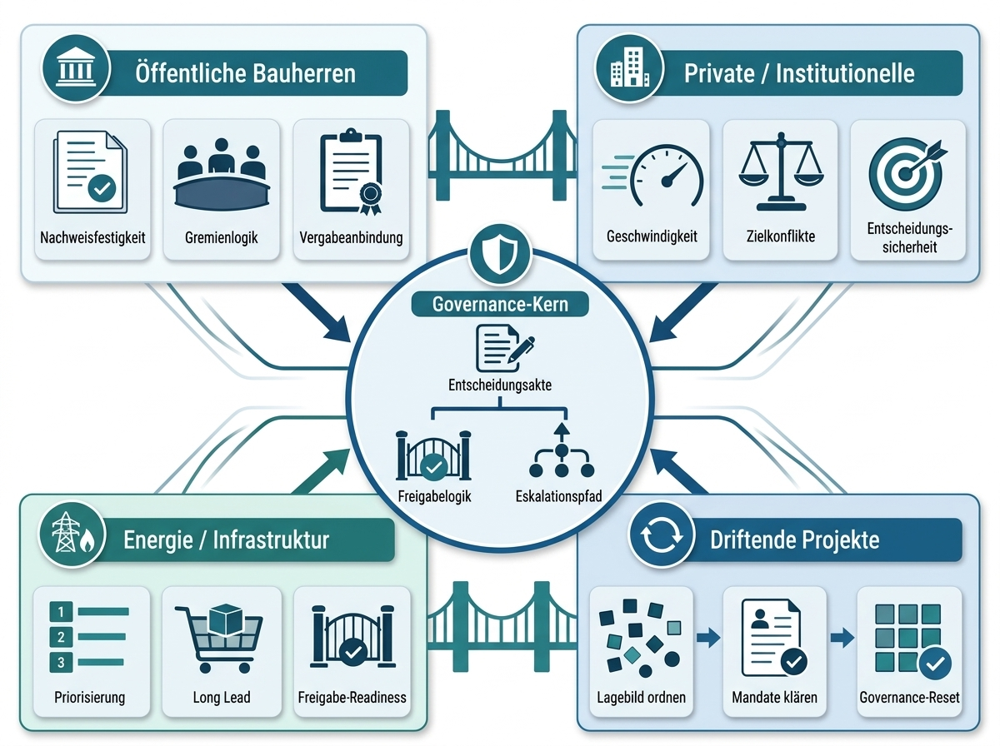

## Öffentliche Bauherren

Öffentliche Bauherren stehen häufig unter hoher Nachweis-, Gremien- und Vergabekomplexität. Entscheidungen müssen nicht nur sachlich plausibel, sondern auch nachvollziehbar, prüfbar und beschlussfähig sein. Der Nutzen des Ansatzes von Bauherr Mentoren liegt hier in klaren Mandaten, Entscheidungsvorlagen, Freigabelogik, Protokollstandard, Vergabeanbindung und belastbar dokumentierten Eskalationen.

## Private und institutionelle Bauherren

Private und institutionelle Bauherren benötigen Steuerbarkeit vor allem dort, wo Geschwindigkeit, Renditeanforderungen, Nutzerinteressen, Finanzierung, ESG/LCC und technische Komplexität zusammentreffen. Der Ansatz hilft, Zielkonflikte früh zu klären und operative Geschwindigkeit nicht gegen Entscheidungssicherheit auszuspielen.

## Energieversorger und Infrastrukturträger

Bei Energieversorgern und Infrastrukturträgern verschieben sich Projektrisiken häufig in Freigaben, Priorisierung, Beschaffung, Entscheidungen zu Komponenten mit langer Lieferzeit und die Disziplin bei der Restkostenprognose. Besonders relevant sind Projektklassenlogik, Entscheidungen über Fortführung oder Stopp, Neu Priorisierung im Projektportfolio, Frühwarnungen, Änderungssteuerung, CTC und Prognose sowie die Freigabereife zum Abschluss von LPH 2 für Variantenwahl und Business Case, von LPH 3 für die FID nach Entwurfsplanung und Kostenberechnung und von LPH 7 für Vergabe oder die Bindung einer Komponente mit langer Lieferzeit.

## Projekte mit schleichendem Steuerungsverlust und MVG-Neuinitialisierung

Projekte mit schleichendem Steuerungsverlust erkennt man selten an einem einzelnen Fehler. Typisch sind unterschiedliche Lagebilder, schleichende Prognoseabweichungen, informelle Eskalationen, ungeordnete Änderungen, unklare Entscheidungsmandate und eine fehlende Wirksamkeit von Maßnahmen. Oft reicht dann keine vollständige Neuaufsetzung, sondern eine gezielte MVG-Neuinitialisierung: Datenstand sichern, Entscheidungslandschaft ordnen, Mandate klären, erforderliche Freigaben nachholen oder wiederholen und den 30/60/90-Orientierungsrahmen für die Neuordnung nutzen. Wie eine solche MVG-Neuinitialisierung im Einzelnen abläuft, vertieft Kapitel 11.

## Typische Entscheidungsprobleme

| Entscheidungsproblem | Warum es kritisch ist | BM-Artefakt bzw. Routine |
|----|----|----|
| Variantenfreigabe ohne vollständige Abwägungsanalyse | Folgekosten, ESG/LCC-Effekte oder Qualitätsauswirkungen werden spät sichtbar. | Entscheidungsvorlage, Wertoptimierung, Checkliste für die Freigabe. |
| Vergabeentscheidung unter Preis- und Lieferkettenunsicherheit | Angebotsgültigkeit, Risiken bei Komponenten mit langer Lieferzeit und Terminfolgen werden nicht zusammengeführt. | CTC und Prognose, Risikoregister, Frühwarnung, Freigabereife. |
| Änderungsantrag mit unvollständiger Auswirkungsbewertung | Kosten, Termin, Qualität, Projektumfang, Risiko und ESG/LCC werden nicht konsistent bewertet und entschieden. | Änderungsregister, verbindliche Auswirkungsbewertung, Änderungsgremium (monatlich, zzgl. anlassbezogener Sondersitzungen). |
| Gremienbeschluss ohne Mandatsklarheit | Beschlüsse werden angreifbar oder müssen nachträglich geheilt werden. | RACI, Mandatsmatrix, Entscheidungsvorlage. |
| MVG-Neuinitialisierung ohne eindeutigen Datenstand | Das Projekt arbeitet mit mehreren Wahrheiten und verliert seine Wiederanlauffähigkeit. | Festschreibung des Datenstands, Entscheidungsregister, MVG-Grundsatzdokument. |

# MVG-Neuinitialisierung als Vertiefungsformat

Dieses Kapitel vertieft die MVG-Neuinitialisierung als Sonderformat außerhalb der regulären Freigabereihe innerhalb der MVG-Leistungsarchitektur. Eine MVG-Neuinitialisierung ist keine Freigabe; ihr Ergebnis kann die Nachholung oder Wiederholung einzelner Freigaben sein, ohne die Abfolge LPH 0–9 zu verändern. Das Kapitel bündelt die wichtigsten Auslöser, Ordnungsfelder und Ergebnisobjekte für laufende Projekte, deren Steuerungs- und Entscheidungslogik nicht mehr ausreichend trägt. Anwendungssituationen nach Branche und Projektstand sind bereits in Kapitel 10 dargestellt.

## Wann eine MVG-Neuinitialisierung erforderlich wird

Eine MVG-Neuinitialisierung wird erforderlich, wenn ein Projekt im bisherigen Modus nicht mehr ausreichend führbar ist. Typische Signale sind:

- Kosten, Termine und Projektumfang entwickeln sich auseinander.

<!-- -->

- Bauherr, Projektleitung, Projektsteuerung, Planung und Gremien nutzen unterschiedliche Lagebilder.

<!-- -->

- Änderungen werden operativ bearbeitet, aber nicht strategisch freigegeben.

<!-- -->

- Risiken sind bekannt, aber nicht mit Risikoannahme, Risikominderung und Entscheidung verbunden.

<!-- -->

- Gremien erhalten Statusberichte, aber keine entscheidungsfähigen Optionen.

<!-- -->

- Neufestlegung der Projektbasis, Fortführung oder Stopp, Moratorium oder Beschleunigung stehen im Raum, ohne klare Entscheidungslogik.

<!-- -->

- Datenstände, Annahmen und Beschlusslagen sind nicht mehr konsistent.

<!-- -->

- Projektsteuerung liefert mehr Information, aber der Bauherr gewinnt keine zusätzliche Führungsfähigkeit.

## Was bei der MVG-Neuinitialisierung neu geordnet wird

Die MVG-Neuinitialisierung ordnet nicht das gesamte Projekt fachlich neu. Sie ordnet die Führungs- und Entscheidungslogik. Im Mittelpunkt stehen:

- Zielbild und aktuelle Zielkonflikte

<!-- -->

- Mandate und Schwellen

<!-- -->

- offene wesentliche Entscheidungen

<!-- -->

- Status der Freigaben sowie erforderliche Nachholungen oder Wiederholungen einzelner Freigaben

<!-- -->

- Datenstand und Annahmen

<!-- -->

- Risiko- und Änderungslage

<!-- -->

- Auswirkungen auf Budget, Termin und Projektumfang

<!-- -->

- Logik zur Neufestlegung der Projektbasis

<!-- -->

- Eskalations- und Gremienlogik

<!-- -->

- Betriebshandbuch für einen stabilisierten Regelbetrieb

Die MVG-Neuinitialisierung beginnt mit einem Lagebild und endet mit einer stabilisierten Entscheidungsarchitektur. Dazwischen liegt die zentrale Bauherrenfrage: Welche Entscheidungen müssen jetzt neu legitimiert werden, damit das Projekt wieder führbar wird?

## Ergebnisbild einer MVG-Neuinitialisierung

Eine wirksame MVG-Neuinitialisierung liefert einen geordneten Führungszustand.

| Ergebnis | Zweck |
|----|----|
| Governance-Lagebild | Zeigt, wo Steuerbarkeit verloren gegangen ist. |
| Entscheidungsinventar | Macht offene, überfällige oder unklare wesentliche Entscheidungen sichtbar. |
| Logik zur Neufestlegung der Projektbasis | Klärt, ob und wie Kosten, Termine, Projektumfang, Risiko oder Mandat neu legitimiert werden müssen. |
| Datenstands­bereinigung | Definiert, welcher Stand für die nächsten Entscheidungen gilt. |
| Nachholung und Wiederholung von Freigaben | Ordnet, welche Freigaben als Ergebnis der MVG-Neuinitialisierung nachgeholt oder wiederholt werden; die Abfolge LPH 0–9 bleibt unverändert. |
| Eskalationsplan | Legt fest, welche Entscheidungen auf welcher Ebene getroffen werden müssen. |
| Stabilisiertes Betriebshandbuch | Führt das Projekt nach der MVG-Neuinitialisierung in einen handhabbaren Regelbetrieb zurück. |

Ob früher Einstieg über die MVG-Reifegradanalyse oder eine MVG-Neuinitialisierung im laufenden Projekt: Am Ende zählt, was der Bauherr an Führungsfähigkeit gewinnt. Das folgende Kapitel zieht Bilanz.

\
Was Bauherren mit MVG und MVG Companion gewinnen
================================================

Für Bauherren zählt am Ende nicht die Zahl der Governance-Artefakte, sondern ihre Führungswirkung. MVG und der MVG Companion schaffen eine pragmatische Architektur, die Entscheidungen schneller vorbereitet, Mandate klarer macht, die Gremienfähigkeit erhöht und Nachweise belastbarer führt.

| Gewinn | Wirkung |
|----|----|
| Klarere Entscheidungen | Entscheidungsfragen, Mandate, Freigaben und Datenstände werden vor der Freigabe zusammengeführt. |
| Schnellere Befähigung | Rollen lernen die MVG-Logik nicht nur in einer Arbeitssitzung, sondern in der Anwendung. |
| Stärkere Übergabe | Betriebshandbuch, Routinen und Unterstützung durch den MVG Companion erleichtern den Regelbetrieb. |
| Bessere Nachweis­fähigkeit | Entscheidungs-IDs, Datenstände und Beschlusslagen bleiben referenzierbar. |
| Geringere Zusatzlast | Der Mindeststandard bleibt auf führungsrelevante Entscheidungen konzentriert. |

**Schlussbild:** Bauherr Mentoren positioniert MVG als schlankes Bauherren-Führungsmodell und den MVG Companion als anwendungsnahen Beschleuniger. Die Kombination macht Bauherrenverantwortung nicht abstrakter, sondern praktischer: vorbereitet, mandatiert, nachvollziehbar und im Regelbetrieb nutzbar. Damit schließt sich der Bogen zur Leitthese dieses Whitepapers: Arbeit kann delegiert werden – bauherrenseitige Legitimation nicht.

## Pragmatischer Einstieg

Der Einstieg ist kein Governance-Großprojekt. Er beginnt mit einer kompakten MVG-Reifegradanalyse, die in kurzer Zeit sichtbar macht, welche Entscheidungen, Mandate, Datenstände und Nachweise kritisch sind. Auf dieser Grundlage kann der Bauherr priorisieren, welche MVG-Bausteine sofort wirksam werden und wo der Companion die Einführung beschleunigt.

| Einstiegspunkt | Kernfrage | Ergebnis |
|----|----|----|
| Reifegradanalyse | Welche Entscheidungen, Mandate, Freigaben und Datenstände sind im 30/60/90-Orientierungsrahmen nach der MVG-Reifegradanalyse relevant? | Lagebild, Entscheidungsliste und priorisierte Umsetzungsschritte. |
| Companion-Kalibrierung | Welche Rollen, Entscheidungsroutinen und Elemente des Betriebshandbuchs sollen mit Unterstützung des Companion verfügbar sein? | Anwendungslogik für Schulung, Pilotierung und Übergabe. |
| Entscheidung für die Pilotierung | Welche echte Entscheidung eignet sich zur Kalibrie­rung des MVG-Modells? | Praxistest mit Freigabefrage, Entscheidungs-ID, Datenstand und Nachweislogik. |

\
Anhang: Glossar
===============

| Begriff | Definition |
|----|----|
| Bauherr | Organisation oder Person, die ein Bau- oder Infrastrukturvorhaben veranlasst, legitimiert und wesentliche Entscheidungen trägt. |
| Bauherrenorganisation | Die Gesamtheit der bauherrenseitigen Rollen, Gremien, Entscheidungswege, Mandate und Unterstützungsfunktionen. |
| Nichtdelegierbare Bauherrenverantwortung | Governance-bezogener Begriff für Verantwortungen, bei denen der Bauherr Ziel, Mandat, wesentliche Entscheidung, Risikoannahme, Freigabe, Datenstand und Nachweis selbst legitimieren muss. |
| Minimum Viable Governance (MVG) | Kleinster funktionsfähiger Governance-Standard, mit dem Bauherrenverantwortung entscheidungsfähig, nachweisbar und operabel wird. |
| Bauherren-Führungsmodell | Das Zusammenspiel aus Zielsystem, Rollen und Mandaten, Freigaben, Entscheidungs-IDs, Datenstands- und Nachweislogik, Risiko-/Änderungs-/Maßnahmenverknüpfung, Restkostenprognose (CTC), Leistungskennzahlen (KPI), Eskalation, Betriebshandbuch und Befähigung zu einer durchgängigen Steuerungsarchitektur – das Führungsmodell, mit dem ein Bauherr ein komplexes Vorhaben steuerbar hält. |
| Mandat | Klar zugewiesene Entscheidungs- und Eskalationsbefugnis einer Rolle oder eines Gremiums, verbunden mit Schwellen, Stellvertretung und Freigabeweg. |
| Entscheidungs-ID | Eindeutige Kennung für eine wesentliche Bauherrenentscheidung. Sie schafft Nachverfolgbarkeit und Referenzlogik. |
| Entscheidungsvorlage | Nachweislogik für eine wesentliche Entscheidung mit Entscheidungsfrage, Bezug zur Freigabe und zum Mandat, Datenstand, Optionen, Annahmen, Auswirkungen, Empfehlung, Freigabeprozess, Beschlusslage und Nachverfolgung. |
| Entscheidungs­reife | Zustand, in dem eine Entscheidung ausreichend vorbereitet ist, um auf der zuständigen Mandatsebene getroffen zu werden. |
| Freigabe | Entscheidung des Bauherrn am Abschluss einer Leistungsphase (LPH 0–9). Die Freigabe gibt die nächste Leistungsphase frei und verbindet Freigabereife, Mandat, Datenstand und Nachweis. Die Freigabe erteilt der Bauherr selbst – nicht Projektsteuerung oder Lenkungskreis. |
| Datenstand | Benannte und versionierte Grundlage, auf der eine Entscheidung getroffen wird. |
| Nachweiskette | Nachvollziehbare Kette von Entscheidungs­grundlagen, Annahmen, Freigaben, Beschlüssen und Nachverfolgung. |
| Betriebshandbuch | Betriebslogik für den Regelbetrieb von MVG mit Rollen, Routinen, Taktung, Eskalation und Prüfmechanismen. |
| Befähigung | Verankerung von MVG in Schlüsselrollen, damit die Bauherrenorganisation das Modell selbst anwenden kann. |
| MVG-Neuinitialisierung | Sonderformat außerhalb der regulären Freigabereihe zur gezielten Neuordnung der Steuerungs- und Entscheidungslogik in laufenden Projekten mit eingeschränkter Steuerbarkeit. |
| ESG | Umwelt-, Sozial- und Governance-Aspekte, die als Entscheidungsdimension in Zielsystem, Varianten und Freigaben berücksichtigt werden können. |
| LCC | Lebenszykluskosten; Kostenbetrachtung über Errichtung, Betrieb, Instandhaltung und Nutzung hinweg als Entscheidungsdimension. |
| Frühwarnung | Unbewertetes Signal und strikte Vorstufe eines Risikos. Erst nach Bestätigung und Bewertung wird daraus ein Risiko; CTC- oder Schwellenwertverletzungen erzeugen neue Frühwarnungen als neue Signale. |
| Neufestlegung der Projektbasis | Sonderformat außerhalb der regulären Freigabereihe zur erneuten Legitimation von Kosten-, Termin-, Projektumfangs- oder Risikogrundlagen. Es wird über eine Entscheidungsvorlage vorbereitet und durch den Bauherrn im Lenkungskreis beschlossen; betroffene Freigaben können anschließend nachgeholt oder wiederholt werden. |
| Finale Investitionsentscheidung (FID) | Investitionsentscheidung zum Abschluss von LPH 3 auf Basis der Kostenberechnung; sie bestätigt die in LPH 2 getroffene Variantenwahl mit Business Case und legitimiert die weitere Projektverfolgung. |
| Übergabe | Die Übergabe des Vorhabens ist in LPH 9 verankert. Die Übergabe des Bauherren-Führungsmodells ist dagegen ein Befähigungsschritt ohne Zuordnung zu einer Freigabe im Leistungsphasen- und Freigabemodell und überführt Rollen, Routinen und Betriebshandbuch in den Eigenbetrieb. |
| Leistungsphasen- und Freigabemodell LPH 0–9 | Zehn HOAI-Leistungsphasen mit einer Freigabe des Bauherrn am jeweiligen Abschluss: LPH 0 · Bedarfsplanung; LPH 1 · Grundlagenermittlung; LPH 2 · Vorplanung; LPH 3 · Entwurfsplanung; LPH 4 · Genehmigungsplanung; LPH 5 · Ausführungsplanung; LPH 6 · Vorbereitung Vergabe; LPH 7 · Vergabe; LPH 8 · Ausführung; LPH 9 · Übergabe. Der Regelbetrieb folgt nach der Freigabe zum Abschluss von LPH 9. |
| 30/60/90-Tage-Plan | Orientierungsrahmen nach der MVG-Reifegradanalyse und im Rahmen einer MVG-Neuinitialisierung, der die ersten Wirkungen priorisiert; kein allgemeiner Einführungsrhythmus. Bis Tag 90 ist das Modell in Anwendung und der Entwurf des Betriebshandbuchs liegt vor; die Übergabe schließt an. |
| Governance | Ordnungs- und Führungsrahmen, der Rollen, Mandate, Entscheidungswege, Freigaben und Nachweise verbindlich miteinander verknüpft. |
| MVG Companion | Optionales, lokal lauffähiges und browserbasiertes Arbeitsmittel, das die Anwendung von Minimum Viable Governance unterstützt; kein Ersatz für Bauherrenentscheidungen oder verbindliche Systeme. |
| Business Case | Wirtschaftliche und strategische Entscheidungsgrundlage, die Nutzen, Aufwand, Risiken und Rahmenbedingungen eines Vorhabens oder einer Variante zusammenführt. |
| RACI | Rollen- und Zuständigkeitsmatrix mit ausführungsverantwortlichen, letztverantwortlichen, konsultierten und informierten Rollen. |
| PMO | Projektmanagementbüro; unterstützt unter anderem Koordination, Berichterstattung, Gremienarbeit, Datenpflege und Nachverfolgung. |
| CTC | Cost to Complete; im Whitepaper als Restkostenprognose verwendet. Bezeichnet die erwarteten noch anfallenden Kosten bis zum Projektabschluss. |
| KPI | Key Performance Indicator; im Whitepaper als Leistungskennzahl verwendet. Dient der verdichteten Beurteilung von Leistung und Steuerungsbedarf. |
| SaaS | Software as a Service, also die Bereitstellung von Software als internetbasierter Dienst. Der MVG Companion ist ausdrücklich keine SaaS-Leistung. |
| Whitepaper | Fachliches Grundlagendokument, das Position, Methodik, Leistungslogik und Anwendungsrahmen von Bauherr Mentoren nachvollziehbar darstellt. |
